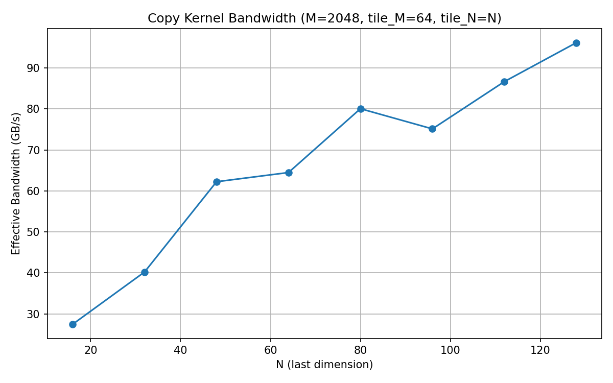

.. _ch02_loesung:

#######################################
Report: GPU Architecture and cuTile
#######################################

.. contents:: Inhaltsverzeichnis
   :local:
   :depth: 2

Einleitung
==========

Dieses Kapitel dokumentiert unsere Lösung des zweiten Assignments:
*GPU Architecture and cuTile*. Ziel ist die Untersuchung von
GPU-Hardware-Eigenschaften sowie die Implementierung tile-basierter
Kernels mit `cuTile <https://github.com/nvidia/cutile-python>`_ –
von Reduktion über elementweise Addition bis zu Bandbreiten-Benchmarks.
Alle Kernels verwenden Tensoren mit Datentyp FP16.

Task 1: GPU Device Properties
=============================

Aufgabenstellung
----------------

Über ``cp.cuda.Device().attributes.items()`` sollen die Werte für
``L2CacheSize``, ``MaxSharedMemoryPerMultiprocessor`` und ``ClockRate``
auf dem DGX-Spark ausgelesen und berichtet werden.

Implementierung
---------------

CuPys ``Device().attributes`` gibt ein Dictionary mit **allen** CUDA-Attributen
zurück. Da ``.items()`` immer alle Schlüssel-Wert-Paare liefert, wird nach der
Iteration über den gewünschten Teilmenge gefiltert:

.. code-block:: python

   def report_device_properties():
       keys_of_interest = {
           "L2CacheSize",
           "MaxSharedMemoryPerMultiprocessor",
           "ClockRate",
       }
       for key, value in cp.cuda.Device().attributes.items():
           if key in keys_of_interest:
               print(f"{key}: {value}")

Erkenntnisse
------------

Gemessene Werte auf dem DGX Spark:

.. list-table::
   :header-rows: 1
   :widths: 45 25 30

   * - Attribut
     - Wert
     - Einheit
   * - ``ClockRate``
     - 2 418 000
     - kHz (≈ 2,42 GHz)
   * - ``L2CacheSize``
     - 25 165 824
     - Bytes (≈ 24 MB)
   * - ``MaxSharedMemoryPerMultiprocessor``
     - 102 400
     - Bytes (100 KB)

Der L2-Cache von 24 MB ist groß genug, um häufig genutzte Tiles zwischen
aufeinanderfolgenden Kernel-Aufrufen zu halten. Der Shared Memory von 100 KB
pro SM ist eine harte Ressourcenschranke, die die maximale Tile-Größe pro Block
begrenzt.

Task 2: Matrix Reduction Kernel
===============================

Aufgabenstellung
----------------

cuTile-Kernel, der eine 2D-Eingabematrix der Form ``(M, K)`` entlang der
letzten Dimension ``K`` zu einem Vektor der Form ``(M,)`` reduziert
(Zeilensumme). Parallelisierung erfolgt über ``M`` via ``grid``; für
Tiles mit Größen jenseits der nächsten Zweierpotenz ist Zero-Padding
innerhalb des Kernels nötig.

Implementierung
---------------

**Kernel**

Jeder Block erhält über ``ct.bid(0)`` seine Zeilen-ID. Das Tile umfasst
die gesamte Zeile ``(1, tile_k)``, wobei ``tile_k`` die nächste
Zweierpotenz ≥ K ist. Überstehende Elemente werden per
``PaddingMode.ZERO`` aufgefüllt, damit die Summe korrekt bleibt:

.. code-block:: python

   @ct.kernel
   def row_sum_kernel(mat, output, tile_k: ct.Constant[int]):
       pid = ct.bid(0)                               # Zeilen-Index dieses Blocks
       tile = ct.load(mat,
                      index=(pid, 0),
                      shape=(1, tile_k),
                      padding_mode=ct.PaddingMode.ZERO)
       row_sum = ct.sum(tile, axis=1)               # (1,)
       ct.store(output, index=(pid,), tile=row_sum)

**Host-Funktion**

.. code-block:: python

   def row_sum(mat: torch.Tensor) -> torch.Tensor:
       M, K = mat.shape
       output = torch.empty(M, dtype=mat.dtype, device=mat.device)
       tile_k = 1
       while tile_k < K:
           tile_k *= 2
       grid = (M, 1, 1)
       ct.launch(torch.cuda.current_stream().cuda_stream,
                grid, row_sum_kernel, (mat, output, tile_k))
       return output

Verifikation
------------

Alle Shapes – auch Nicht-Zweierpotenzen für K – bestehen ``torch.allclose``
(``atol=1e-2``, ``rtol=1e-2`` für FP16-Präzision):

.. code-block:: text

   Task 2: Matrix Reduction Kernel
     M=64,  K=128 → allclose=True
     M=128, K=100 → allclose=True
     M=256, K=37  → allclose=True

Erkenntnisse: Einfluss von M und K
-----------------------------------

.. list-table::
   :header-rows: 1
   :widths: 15 85

   * - Dimension
     - Effekt
   * - **M ↑**
     - Mehr Blöcke starten parallel → bessere GPU-Auslastung. Bei sehr
       kleinem M bleiben viele Streaming-Multiprozessoren (SMs) idle.
   * - **M ↓**
     - Weniger Parallelismus; GPU unterausgelastet. Der Overhead für
       Kernel-Start dominiert bei winzigem M.
   * - **K ↑**
     - Mehr Arbeit pro Block (höherer pro-Block-Load). Gleichzeitig
       wächst die Tile-Größe (nächste Zweierpotenz), was mehr Shared
       Memory belegt.
   * - **K ↓**
     - Blöcke sind schnell fertig; GPU-Utilization sinkt, weil die
       Rechenzeit je Block gering ist und Latenz dominiert.

Task 3: 4D Tensor Elementwise Addition
=======================================

Aufgabenstellung
----------------

cuTile-Kernel zur elementweisen Addition zweier 4D-Tensoren ``A`` und
``B`` der Form ``(M, N, K, L)``. Zwei Varianten:

1. Output-Tile deckt die Dimensionen ``K`` und ``L`` ab, parallelisiert
   wird über ``M`` und ``N``.
2. Output-Tile deckt die Dimensionen ``M`` und ``N`` ab, parallelisiert
   wird über ``K`` und ``L``.

Benchmark mit :math:`|M| = 16`, :math:`|N| = 128`, :math:`|K| = 16`,
:math:`|L| = 128` via ``triton.testing.do_bench``.

Implementierung: Variante 1 – Tile (K, L), Grid (M, N)
-------------------------------------------------------

Jeder Block ist über ``(pid_m, pid_n)`` eindeutig einer ``(m, n)``-Position
zugeordnet und bearbeitet den gesamten ``(K, L)``-Slice dieser Position:

.. code-block:: python

   @ct.kernel
   def add_4d_tile_KL(A, B, C, tile_k: ct.Constant[int], tile_l: ct.Constant[int]):
       pid_m = ct.bid(0)
       pid_n = ct.bid(1)
       a_tile = ct.load(A, index=(pid_m, pid_n, 0, 0),
                        shape=(1, 1, tile_k, tile_l),
                        padding_mode=ct.PaddingMode.ZERO)
       b_tile = ct.load(B, index=(pid_m, pid_n, 0, 0),
                        shape=(1, 1, tile_k, tile_l),
                        padding_mode=ct.PaddingMode.ZERO)
       ct.store(C, index=(pid_m, pid_n, 0, 0), tile=a_tile + b_tile)

   def add_4d_variant1(A, B):
       M, N, K, L = A.shape
       C = torch.empty_like(A)
       grid = (M, N, 1)                  # 16 × 128 = 2048 Blöcke
       ct.launch(torch.cuda.current_stream().cuda_stream,
                 grid, add_4d_tile_KL, (A, B, C, K, L))
       return C

Implementierung: Variante 2 – Tile (M, N), Grid (K, L)
-------------------------------------------------------

Jeder Block ist über ``(pid_k, pid_l)`` eindeutig einer ``(k, l)``-Position
zugeordnet und bearbeitet den gesamten ``(M, N)``-Slice dieser Position:

.. code-block:: python

   @ct.kernel
   def add_4d_tile_MN(A, B, C, tile_m: ct.Constant[int], tile_n: ct.Constant[int]):
       pid_k = ct.bid(0)
       pid_l = ct.bid(1)
       a_tile = ct.load(A, index=(0, 0, pid_k, pid_l),
                        shape=(tile_m, tile_n, 1, 1),
                        padding_mode=ct.PaddingMode.ZERO)
       b_tile = ct.load(B, index=(0, 0, pid_k, pid_l),
                        shape=(tile_m, tile_n, 1, 1),
                        padding_mode=ct.PaddingMode.ZERO)
       ct.store(C, index=(0, 0, pid_k, pid_l), tile=a_tile + b_tile)

   def add_4d_variant2(A, B):
       M, N, K, L = A.shape
       C = torch.empty_like(A)
       grid = (K, L, 1)                  # 16 × 128 = 2048 Blöcke
       ct.launch(torch.cuda.current_stream().cuda_stream,
                 grid, add_4d_tile_MN, (A, B, C, M, N))
       return C

Verifikation
------------

Beide Varianten bestehen ``torch.allclose`` gegen PyTorchs natives ``A + B``:

.. code-block:: text

   Task 3a: 4D Elementwise Addition — Verifikation
     Variante 1 (tile KL, grid MN) passed
     Variante 2 (tile MN, grid KL) passed

Erkenntnisse: Benchmark und Erklärung
--------------------------------------

.. code-block:: text

   Task 3b: Benchmark
     Variante 1 (tile KL): 0.1393 ms
     Variante 2 (tile MN): 0.4958 ms

**Variante 1 ist ≈ 3,6× schneller als Variante 2.**

Der Grund liegt in der Speicherzugriffslokalität. PyTorch speichert Tensoren
im Row-Major-Format (C-contiguous), d. h. die *letzten* Dimensionen sind im
Speicher zusammenhängend. Bei einem Tensor der Form ``(M, N, K, L)`` liegen
aufeinanderfolgende ``L``-Elemente direkt nebeneinander; dann kommen die
``K``-Elemente, und so weiter.

* **Variante 1** tiled über ``(K, L)`` – also über die letzten beiden,
  zusammenhängenden Dimensionen. Jeder Block greift auf einen einzigen
  contiguous Speicherbereich von ``K × L = 16 × 128 = 2048`` Elementen zu.
  Das ermöglicht coalesced Memory Accesses mit hoher effektiver Bandbreite.

* **Variante 2** tiled über ``(M, N)`` – die äußeren Dimensionen. Für eine
  feste ``(k, l)``-Position sind die ``M × N``-Elemente im Speicher mit
  einem Stride von ``K × L`` verteilt. Diese nicht-zusammenhängenden Zugriffe
  können nicht gecached werden und führen zu vielen separaten Speichertransaktionen
  (uncoalesced accesses), was den Durchsatz erheblich reduziert.

Task 4: Benchmarking Bandwidth
==============================

Aufgabenstellung
----------------

cuTile-Kernel, der eine 2D-Matrix der Form ``(M, N)`` kopiert
(Tile-Größe ``(tile_M, tile_N)``). Für ``M = 2048`` und
``N`` zwischen 16 und 128 wird bei ``tile_M = 64`` und ``tile_N = N``
die effektive Speicherbandbreite gemessen:

.. math::

   \text{bandwidth (GB/s)} = \frac{2 \cdot M \cdot N \cdot \text{sizeof(element)}}{t_s \cdot 10^9}

Der Faktor 2 berücksichtigt je einen Lese- und einen Schreibzugriff.

Implementierung
---------------

**Kernel**

.. code-block:: python

   @ct.kernel
   def copy_kernel(src, dst, tile_m: ct.Constant[int], tile_n: ct.Constant[int]):
       pid_m = ct.bid(0)
       pid_n = ct.bid(1)
       tile = ct.load(src, index=(pid_m, pid_n), shape=(tile_m, tile_n),
                      padding_mode=ct.PaddingMode.ZERO)
       ct.store(dst, index=(pid_m, pid_n), tile=tile)

**Host-Funktion**

Tile-Dimensionen werden auf die nächste Zweierpotenz aufgerundet. Das Grid
wird mit ``ct.cdiv`` so berechnet, dass die gesamte Matrix abgedeckt ist:

.. code-block:: python

   def copy_matrix(src, tile_m, tile_n):
       M, N = src.shape
       dst = torch.empty_like(src)
       tile_m_pow2 = next_power_of_2(tile_m)
       tile_n_pow2 = next_power_of_2(tile_n)
       grid = (ct.cdiv(M, tile_m_pow2), ct.cdiv(N, tile_n_pow2), 1)
       ct.launch(torch.cuda.current_stream().cuda_stream,
                 grid, copy_kernel, (src, dst, tile_m_pow2, tile_n_pow2))
       return dst

Verifikation
------------

.. code-block:: text

   Task 4a: Copy Kernel — Verification
     Copy kernel verified.

Erkenntnisse: Bandwidth-Messungen
-----------------------------------

Gemessene Werte (M=2048, tile_M=64, tile_N=N, FP16):

.. list-table::
   :header-rows: 1
   :widths: 15 25 25

   * - N
     - Laufzeit (ms)
     - Bandbreite (GB/s)
   * - 16
     - 0,0048
     - 27,48
   * - 32
     - 0,0065
     - 40,24
   * - 48
     - 0,0063
     - 62,25
   * - 64
     - 0,0081
     - 64,49
   * - 80
     - 0,0082
     - 80,06
   * - 96
     - 0,0105
     - 75,14
   * - 112
     - 0,0106
     - 86,67
   * - 128
     - 0,0109
     - 96,17

   Effektive Speicherbandbreite des Copy-Kernels in Abhängigkeit von N.

**Beobachtungen:**

* Die Bandbreite steigt von 27 GB/s (N=16) auf 96 GB/s (N=128) mit
  wachsendem N, weil größere Tiles den Overhead pro Speichertransaktion
  amortisieren und der Speicherbus besser ausgelastet wird.
* Bei N=96 (nicht Zweierpotenz) sinkt die Bandbreite leicht gegenüber N=80,
  da ``tile_N`` auf 128 aufgerundet wird. Die 32 zusätzlichen Padding-Elemente
  pro Zeile werden geladen und gespeichert, tragen aber nicht zur nützlichen
  Datenmenge bei, was die effektive Bandbreite drückt.
* Die höchste gemessene Bandbreite (≈ 96 GB/s bei N=128) entspricht einem
  Bruchteil der theoretischen Spitzenbandbreite des DGX Spark, was zeigt,
  dass einfache Copy-Workloads noch nicht den Speicher sättigen.

Verifikation – Gesamtübersicht
===============================

.. list-table::
   :header-rows: 1
   :widths: 15 40 20 25

   * - Task
     - Test
     - Referenz
     - Ergebnis
   * - 1
     - Attributabfrage über CuPy
     - CUDA Device API
     - ✓ korrekte Werte
   * - 2
     - ``row_sum`` für (64,128), (128,100), (256,37)
     - ``torch.sum(mat, dim=1)``
     - ✓ allclose (alle Shapes)
   * - 3a
     - ``add_4d_variant1`` und ``add_4d_variant2``
     - ``A + B`` (PyTorch)
     - ✓ allclose (beide Varianten)
   * - 3b
     - Benchmark
     - —
     - Variante 1 ≈ 3,6× schneller
   * - 4a
     - ``copy_matrix`` für (2048, 64)
     - ``torch.equal``
     - ✓ exakte Kopie
   * - 4b
     - Bandwidth-Sweep N=16…128
     - —
     - 27–96 GB/s, steigend

Beiträge
=========

.. list-table::
   :header-rows: 1
   :widths: 30 70

   * - Person
     - Beitrag
   * - Moritz Martin
     - Implementierung aller cuTile-Kernels (Task 1–4),
       Verifikation und Benchmarks, Bandwidth-Plot
   * - Oliver Dietzel
     - Sphinx-Dokumentation (Report), GitHub Actions CI/CD, Requirements
