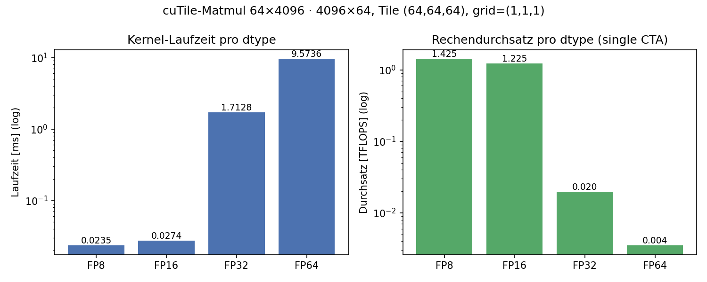
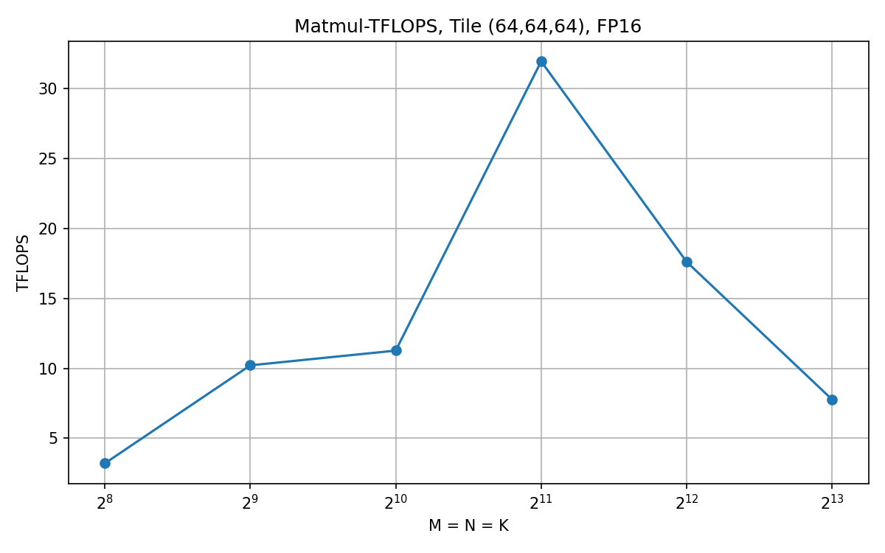
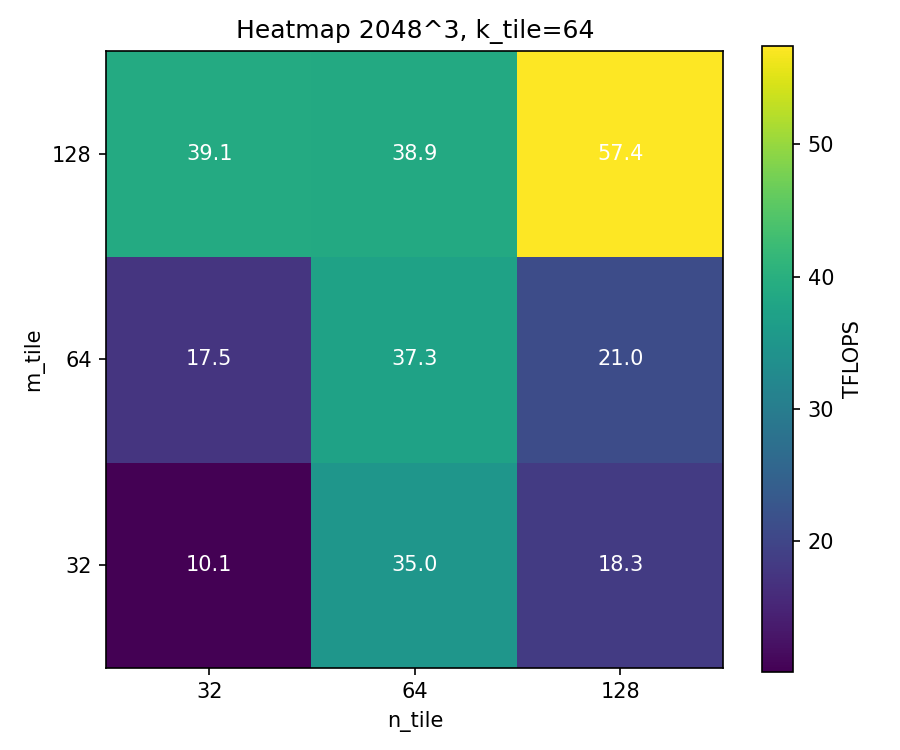
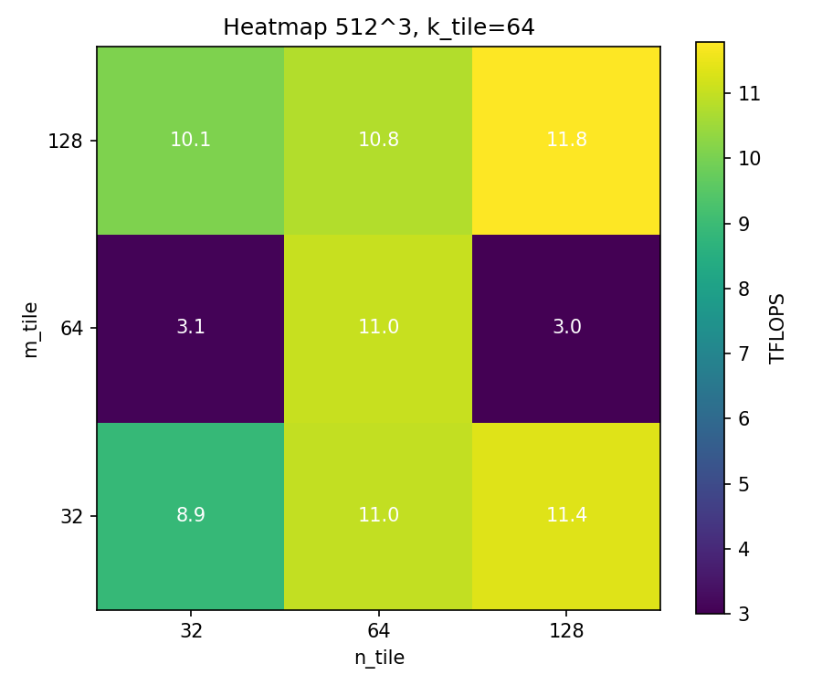
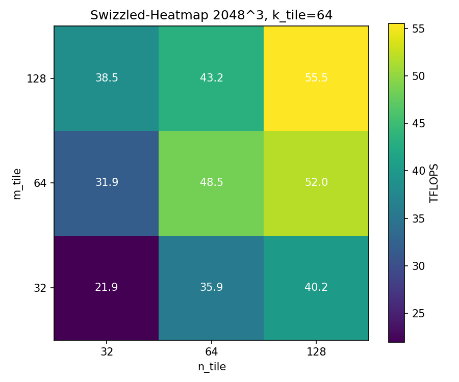
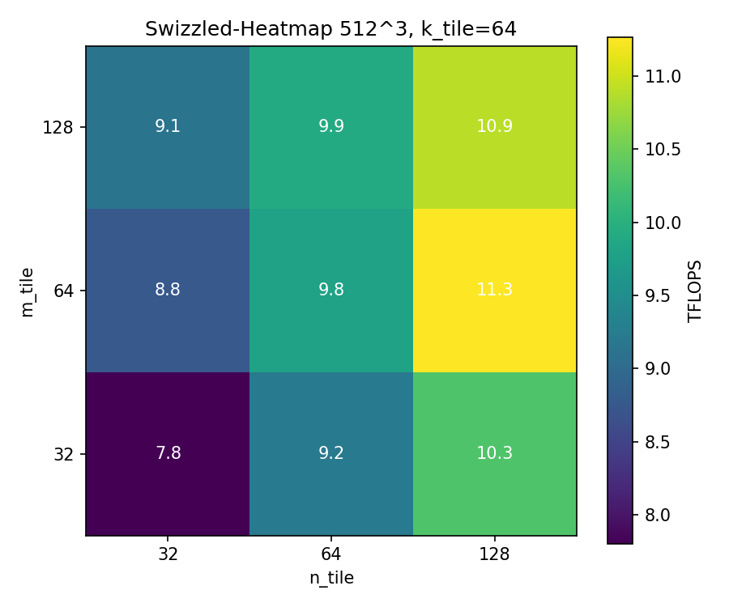

.. _ch03_loesung:

############################################
Report: Matrix Multiplication with cuTile
############################################

.. contents:: Inhaltsverzeichnis
   :local:
   :depth: 2

Einleitung
==========

Dieses Kapitel dokumentiert unsere Lösung des dritten Assignments:
*Matrix Multiplication with cuTile*. Ziel ist die Implementierung und
Optimierung GPU-basierter Matrizenmultiplikations-Kernels mit
`cuTile <https://github.com/nvidia/cutile-python>`_ – von einem
Präzisionsvergleich zwischen FP16 und FP32 über einen flexiblen
Matmul-Kernel bis hin zu Tiling-Benchmarks und L2-Cache-Optimierung
durch Block-Swizzling.

Task 1: FP32 vs FP16 Performance
==================================

Aufgabenstellung
-----------------

Zwei cuTile-Kernels berechnen jeweils :math:`A \times B = C` mit den
Shapes ``(64, 4096) × (4096, 64) → (64, 64)``. ``kernel_fp16`` verwendet
FP16-Eingaben mit FP32-Akkumulator; ``kernel_fp32`` arbeitet durchgehend
in FP32. Beide nutzen ``ct.mma`` mit fester Tile-Größe
``(m_tile=64, n_tile=64, k_tile=64)`` und einem einzigen CTA
(``grid = (1, 1, 1)``).

Implementierung
----------------

**Kernel-Struktur**

Beide Kernels folgen demselben Muster: ein FP32-Akkumulator wird mit Null
initialisiert und in einer Schleife über die K-Dimension per ``ct.mma``
aufgefüllt. Weil das Grid nur einen Block enthält, entfällt jede
BID-Arithmetik – der einzige Block produziert das komplette ``(64, 64)``-
Output-Tile. Bei ``K = 4096`` und ``tile_k = 64`` sind das ``64``
K-Iterationen:

.. code-block:: python

   M, K, N = 64, 4096, 64
   TILE_M, TILE_N, TILE_K = 64, 64, 64
   NUM_K_TILES = K // TILE_K          # 64

   @ct.kernel
   def kernel_fp16(A, B, C):
       acc = ct.full((TILE_M, TILE_N), 0, dtype=ct.float32)
       for k in range(NUM_K_TILES):
           a_tile = ct.load(A, index=(0, k), shape=(TILE_M, TILE_K),
                            padding_mode=ct.PaddingMode.ZERO)
           b_tile = ct.load(B, index=(k, 0), shape=(TILE_K, TILE_N),
                            padding_mode=ct.PaddingMode.ZERO)
           acc = ct.mma(a_tile, b_tile, acc)
       ct.store(C, index=(0, 0), tile=acc)

**Host-Funktionen**

.. code-block:: python

   def run_fp16(A, B):
       C = torch.empty(M, N, dtype=torch.float32, device=A.device)
       ct.launch(torch.cuda.current_stream().cuda_stream,
                 (1, 1, 1), kernel_fp16, (A, B, C))
       return C

Die FP32-Variante ist strukturell identisch. Akkumulator in beiden Fällen FP32.

Ergänzung aus Interesse: FP8 und FP64
--------------------------------------

Da ``ct.mma`` laut `cuTile-Doku
<https://docs.nvidia.com/cuda/cutile-python/generated/cuda.tile.mma.html>`_
auch FP8 (E4M3) und FP64 als Input-Datentypen akzeptiert, haben wir die
beiden Pflicht-Varianten um zwei zusätzliche Kernels ergänzt – identisch
aufgebaut, nur mit anderem Input-/Akkumulator-dtype:

* ``kernel_fp8``  – Inputs in ``torch.float8_e4m3fn``, Akkumulator FP32
* ``kernel_fp64`` – Inputs und Akkumulator in FP64

Verifikation
-------------

Alle vier Kernels bestehen ``torch.allclose`` gegen ``torch.matmul``.
Die Toleranzen wurden pro Präzision skaliert (FP8 hat nur 3 Mantissa-Bits,
daher sehr großzügig; FP64 dagegen extrem scharf):

.. code-block:: text

   Task 1a: FP16 vs FP32 — Verifikation
     kernel_fp16 → allclose=True
     kernel_fp32 → allclose=True
   Task 1a-extra: FP8 und FP64 — Verifikation
     kernel_fp8  → allclose=True
     kernel_fp64 → allclose=True

Erkenntnisse: Benchmark und Speedup
------------------------------------

Gemessene Laufzeiten (``triton.testing.do_bench``, DGX Spark, GB10):

.. code-block:: text

   Task 1b: FP8 / FP16 / FP32 / FP64 — Benchmark
     kernel_fp8 : 0.0235 ms  (  1.425 TFLOPS,  72.75x vs FP32)
     kernel_fp16: 0.0274 ms  (  1.225 TFLOPS,  62.54x vs FP32)
     kernel_fp32: 1.7128 ms  (  0.020 TFLOPS,   1.00x vs FP32)
     kernel_fp64: 9.5736 ms  (  0.004 TFLOPS,   0.18x vs FP32)

Umgerechnet in TFLOPS (:math:`2 \cdot M \cdot N \cdot K \approx 33{,}55\,\text{MFLOP}`):

.. list-table::
   :header-rows: 1
   :widths: 20 20 25 20 15

   * - Kernel
     - Laufzeit
     - Durchsatz
     - Vergleich zu FP32
     - Mantissa-Bits
   * - ``kernel_fp8``
     - 0,024 ms
     - 1,43 TFLOPS
     - **72,8× schneller**
     - 3
   * - ``kernel_fp16``
     - 0,027 ms
     - 1,23 TFLOPS
     - **62,5× schneller**
     - 10
   * - ``kernel_fp32``
     - 1,713 ms
     - 0,020 TFLOPS
     - 1× (Referenz)
     - 23
   * - ``kernel_fp64``
     - 9,574 ms
     - 0,004 TFLOPS
     - **5,6× langsamer**
     - 52

   Links: Kernel-Laufzeit pro Datentyp (log-Skala). Rechts: Rechendurchsatz
   in TFLOPS (log-Skala). Beide Achsen logarithmisch, weil die Spanne
   über fast vier Größenordnungen geht.

**Warum ist FP16 so viel schneller als FP32?**

Das liegt an den 2 Arten von Recheneinheiten, die ein Blackwell-SM enthält:

* **Tensor Cores** – spezialisierte Hardware, die eine komplette
  Matrix-Multiply-Accumulate-Operation auf einem kleinen Tile *in einem
  Schritt* ausführt. Diese schnellen Pfade existieren aber nur für
  *niedrigpräzise* Datentypen (FP8, FP16, BF16, TF32, INT8).
* **CUDA Cores** – die klassischen skalaren Recheneinheiten, die
  elementweise multiplizieren und addieren. Das ist der einzige Pfad
  für "echtes" FP32 – und damit deutlich langsamer.

Bei FP16-Inputs nutzt ``ct.mma`` die Tensor Cores und rechnet einen
ganzen ``64×64×64``-Tile-Block in wenigen Takten. Bei FP32 gibt es
keinen FP32-Tensor-Core-Pfad, daher läuft dieselbe Rechnung über die
CUDA Cores – Schritt für Schritt.

**Zwei Beobachtungen sind interessant:**

* **FP8 ist nur ~1,16× schneller als FP16**, obwohl FP8-Werte halb so
  viel Speicher brauchen.
* **FP64 ist ~5,6× langsamer als FP32** – also fast 350× langsamer
  als FP16.

**Praktische Konsequenz**

Für Matmul-Workloads auf dem GB10 lohnt sich der Wechsel auf FP16 fast
immer, solange die FP32-Akkumulation die Präzision trägt. FP8 bringt auf dieser
GPU keinen nennenswerten Zusatzgewinn, FP64 ist für produktive
Rechnungen ungeeignet.

Task 2: Simple Matrix Multiplication Kernel
============================================

Aufgabenstellung
-----------------

Allgemeiner cuTile-Kernel für ``C = A @ B`` mit beliebigen Shapes
``(M, K) × (K, N) → (M, N)``. Block-IDs werden im Row-Major-Order
zugewiesen; Tile-Größen werden durch die aufrufende Funktion übergeben.
Nicht-Zweierpotenzen sollen unterstützt werden; die Akkumulation erfolgt
über ``ct.mma``.

Implementierung
----------------

**Row-Major-BID-Mapping**

Das Grid wird flach als 1D gestartet (``grid = (num_tiles_m * num_tiles_n,
1, 1)``). Im Kernel wird die flache Block-ID in die 2D-Tile-Koordinate
``(pid_m, pid_n)`` umgerechnet:

.. math::

   \text{pid\_m} = \left\lfloor \frac{\text{bid}}{\text{num\_tiles\_n}} \right\rfloor,
   \quad
   \text{pid\_n} = \text{bid} \bmod \text{num\_tiles\_n}

Damit entspricht ``bid 0`` dem oberen linken Output-Tile, ``bid 1`` dem
Tile rechts daneben und so weiter – genau wie gefordert.

**Kernel**

.. code-block:: python

   @ct.kernel
   def matmul_kernel(A, B, C,
                     M: ct.Constant[int], N: ct.Constant[int], K: ct.Constant[int],
                     tile_m: ct.Constant[int],
                     tile_n: ct.Constant[int],
                     tile_k: ct.Constant[int]):
       bid = ct.bid(0)
       num_tiles_n = ct.cdiv(N, tile_n)
       pid_m = bid // num_tiles_n
       pid_n = bid %  num_tiles_n

       acc = ct.full((tile_m, tile_n), 0, dtype=ct.float32)

       num_tiles_k = ct.cdiv(K, tile_k)
       for k in range(num_tiles_k):
           a_tile = ct.load(A, index=(pid_m, k), shape=(tile_m, tile_k),
                            padding_mode=ct.PaddingMode.ZERO)
           b_tile = ct.load(B, index=(k, pid_n), shape=(tile_k, tile_n),
                            padding_mode=ct.PaddingMode.ZERO)
           acc = ct.mma(a_tile, b_tile, acc)

       ct.store(C, index=(pid_m, pid_n), tile=acc)

**Host-Funktion**

.. code-block:: python

   def matmul(A, B, tile_m, tile_n, tile_k):
       M, K = A.shape
       _, N = B.shape
       C = torch.empty(M, N, dtype=torch.float32, device=A.device)

       num_tiles_m = (M + tile_m - 1) // tile_m
       num_tiles_n = (N + tile_n - 1) // tile_n
       grid = (num_tiles_m * num_tiles_n, 1, 1)

       ct.launch(torch.cuda.current_stream().cuda_stream,
                 grid, matmul_kernel,
                 (A, B, C, M, N, K, tile_m, tile_n, tile_k))
       return C

**Umgang mit Nicht-Zweierpotenzen**

Für Shapes, bei denen ``M``, ``N`` oder ``K`` keine Vielfachen der
Tile-Größe sind, liegen die Rand-Tiles teilweise außerhalb der
Matrix. Zwei cuTile-Mechanismen lösen das ohne explizites Masking:

* ``ct.load(..., padding_mode=ct.PaddingMode.ZERO)`` füllt fehlende
  Elemente am Rand mit ``0``.
* ``ct.store`` ignoriert out-of-bounds Elemente von Rand-Tiles automatisch
  (laut cuTile-Doku).
  -> wir schreiben wir nie über die Grenzen von ``C`` hinaus.

Verifikation
-------------

Der Kernel wird gegen ``torch.matmul`` geprüft – sowohl für Zweierpotenzen
als auch für bewusst „schiefe“ Shapes, inklusive ``K``-Werten, die kein
Vielfaches von ``tile_k`` sind:

.. code-block:: text

   Task 2: Simple Matmul Kernel — Verifikation
     (M,N,K)=(256,256,256), tile=(64,64,64) → allclose=True
     (M,N,K)=(512,256,128), tile=(64,64,64) → allclose=True
     (M,N,K)=(300,200,100), tile=(64,64,64) → allclose=True
     (M,N,K)=(129,257,65),  tile=(32,64,32) → allclose=True

Als Toleranz wurden ``atol=1e-1`` und ``rtol=1e-2`` gewählt (FP16-Inputs,
FP32-Akkumulator).

Erkenntnisse
-------------

Die Mischung aus Tile-Größen und absichtlich „schiefen“ Shapes deckt in
einem einzigen Test drei unabhängige Korrektheitsbedingungen ab, die alle
gleichzeitig stimmen müssen. Dass alle vier Cases ``allclose`` bestehen,
bestätigt:

.. list-table::
   :header-rows: 1
   :widths: 30 70

   * - Mechanismus
     - Bestätigung durch
   * - **Row-Major-BID-Mapping**
     - (512, 256, 128) ist rechteckig – ein fehlerhaftes Mapping würde
       ``pid_m`` und ``pid_n`` vertauschen oder die Zeilenlänge falsch
       berechnen und einen komplett anderen Tensor erzeugen.
   * - **Auto-Clipping von ``ct.store``**
     - (300, 200, 100) und (129, 257, 65) haben Rand-Tiles, die *über*
       ``C`` hinausragen (300/64 = 4,69 Rand-Tiles). Ohne Auto-Clipping
       würde der Kernel Speicher außerhalb von ``C`` überschreiben oder
       sichtbare Müll-Werte in den Randzeilen/-spalten erzeugen.
   * - **Padding-Zero beim Load**
     - Bei ``K = 100`` bzw. ``K = 65`` ist die letzte K-Iteration nur
       teilweise mit echten Daten belegt. Mit ``PaddingMode.ZERO`` sind
       die fehlenden Elemente neutral für das MAC; jede andere
       Padding-Semantik (``UNDETERMINED``, ``NaN``) würde zu sofort
       sichtbaren Fehlern führen.

**Warum kommen wir ohne explizite Masken aus?**

Im Gegensatz zu Triton, wo ``tl.store(..., mask=...)`` nötig ist,
übernimmt cuTile das Boundary-Handling auf Framework-Ebene.
Wichtig bleibt, den *Load* explizit mit ``PaddingMode.ZERO`` zu
annotieren – ohne Padding-Mode wäre der Wert außerhalb der Matrix
undefiniert.

**Welche Freiheitsgrade bleiben?**

Der Kernel ist bewusst schlicht gehalten:

* keine Shared-Memory-Reuse zwischen Tiles

  * jeder Block lädt seine A- und B-Tiles in jeder K-Iteration frisch aus
    dem globalen Speicher (``ct.load`` in der K-Schleife)
  * benachbarte Blöcke teilen Zeilen von A bzw. Spalten von B nicht aktiv
    untereinander – kein Double-Buffering, kein kooperatives Laden.

* keine Block-ID-Optimierung für L2-Reuse

  * stures Row-Major-Mapping ``pid_m = bid // num_tiles_n``,
    ``pid_n = bid % num_tiles_n`` –
  * kein L2-freundliches Swizzling. Nicht so wie in Task 4

* keine spezialisierten Tile-Größen pro Shape

  * ``tile_m``, ``tile_n``, ``tile_k`` sind reine Aufruf-Parameter, wird nicht abgleitet aus ``(M, N, K)``

Task 3: Benchmarking the Matrix Multiplication Kernel
======================================================

Aufgabenstellung
----------------

Benchmark des Matmul-Kernels aus Task 2. Performance wird in TFLOPS angegeben
mit

.. math::

   \text{TFLOPS} = \frac{2 \cdot M \cdot N \cdot K}{t_s \cdot 10^{12}}.

Teil **a)** misst den Kernel mit Tile ``(64, 64, 64)`` für quadratische
Matmuls :math:`M = N = K \in \{256, 512, 1024, 2048, 4096, 8192\}` und
plottet die TFLOPS. Teil **b)** fixiert die Matrixgröße auf
:math:`2048^3` und :math:`512^3` und sweept alle 27 Kombinationen
:math:`m_{tile}, n_{tile}, k_{tile} \in \{32, 64, 128\}`. Visualisiert
wird als Heatmap mit fixiertem ``k_tile = 64``, die beste Kombination wird
berichtet.

Implementierung
---------------

**Matmul-Kernel (row-major BID-Mapping)**

Jedes Programm berechnet ein Output-Tile :math:`(t_m, t_n)`. Aus der 1D-``bid``
ergeben sich die 2D-Tile-Indizes über Division/Modulo nach
``num_bid_n``. In der K-Schleife wird je ein A-Tile :math:`(t_m, t_k)`
und ein B-Tile :math:`(t_k, t_n)` mit ``ct.PaddingMode.ZERO`` geladen
(deshalb funktionieren auch nicht-Zweierpotenz-Shapes), per ``ct.mma``
auf einen FP32-Akkumulator akkumuliert, am Ende auf den Output-Dtype
gecastet und zurückgeschrieben.

.. code-block:: python

   @ct.kernel
   def matmul_kernel(A, B, C,
                     tm: ct.Constant[int],
                     tn: ct.Constant[int],
                     tk: ct.Constant[int]):
       bid = ct.bid(0)

       M = A.shape[0]
       N = B.shape[1]

       # row-major Mapping aus 1D-bid
       num_bid_n = ct.cdiv(N, tn)
       bidx = bid // num_bid_n          # Zeilen-Index des Tiles
       bidy = bid % num_bid_n           # Spalten-Index des Tiles

       # Anzahl K-Tiles entlang axis=1 von A
       num_tiles_k = ct.num_tiles(A, axis=1, shape=(tm, tk))

       # FP32-Akkumulator, FP32-Inputs als tf32 für Tensor Cores
       accumulator = ct.full((tm, tn), 0, dtype=ct.float32)
       zero_pad = ct.PaddingMode.ZERO
       dtype = ct.tfloat32 if A.dtype == ct.float32 else A.dtype

       for k in range(num_tiles_k):
           a = ct.load(A, index=(bidx, k), shape=(tm, tk),
                       padding_mode=zero_pad).astype(dtype)
           b = ct.load(B, index=(k, bidy), shape=(tk, tn),
                       padding_mode=zero_pad).astype(dtype)
           accumulator = ct.mma(a, b, accumulator)

       accumulator = ct.astype(accumulator, C.dtype)
       ct.store(C, index=(bidx, bidy), tile=accumulator)

**Host-Funktion**

.. code-block:: python

   def cutile_matmul(A, B, tm, tn, tk):
       M, K = A.shape
       _, N = B.shape
       C = torch.empty((M, N), device=A.device, dtype=A.dtype)
       grid = (ct.cdiv(M, tm) * ct.cdiv(N, tn), 1, 1)
       ct.launch(torch.cuda.current_stream().cuda_stream,
                 grid, matmul_kernel, (A, B, C, tm, tn, tk))
       return C

**TFLOPS-Helfer**

.. code-block:: python

   def tflops(M, N, K, time_ms):
       return (2.0 * M * N * K) / (time_ms / 1000.0 * 1e12)

Verifikation
------------

Korrektheit gegen ``torch.matmul`` mit absichtlich nicht-Zweierpotenz-Shapes:

.. code-block:: python

   M, K, N = 257, 513, 129
   A = torch.randn(M, K, dtype=torch.float16, device="cuda")
   B = torch.randn(K, N, dtype=torch.float16, device="cuda")
   C = cutile_matmul(A, B, tm=64, tn=64, tk=64)
   assert torch.allclose(C, torch.matmul(A, B), atol=1e-1, rtol=1e-1)

Output:

.. code-block:: text

   Task 3: Verifikation
     Matmul-Kernel verifiziert.

Erkenntnisse: Task 3a – Quadratischer Sweep
--------------------------------------------

Tile ``(64, 64, 64)``, FP16-Inputs, FP32-Akkumulator:

.. list-table::
   :header-rows: 1
   :widths: 20 30 30

   * - M = N = K
     - Laufzeit (ms)
     - TFLOPS
   * - 256
     - 0,0111
     - 3,02
   * - 512
     - 0,0275
     - 9,75
   * - 1024
     - 0,0746
     - 28,79
   * - 2048
     - 0,3687
     - 46,59
   * - 4096
     - 9,2538
     - 14,85
   * - 8192
     - 76,1466
     - 14,44

   Erreichte TFLOPS des row-major Kernels für quadratische Matmuls
   mit Tile ``(64, 64, 64)``.

**Beobachtungen:**

* Bis :math:`N = 2048` skaliert die Performance erwartungsgemäß: kleinere
  Größen (256, 512) sind launch- bzw. latenzgebunden, mit wachsendem
  :math:`N` werden die 48 SMs der DGX Spark immer besser ausgelastet.
* Maximum bei :math:`N = 2048` mit ≈ 47 TFLOPS – hier passen die
  wiederverwendeten A/B-Tiles noch gut in den 24 MB L2-Cache.
* Ab :math:`N = 4096` bricht die Performance auf ≈ 15 TFLOPS ein: der
  Working-Set übersteigt den L2 deutlich, und das row-major BID-Mapping
  produziert nun viele L2-Misses, da nebeneinander laufende Blöcke
  unterschiedliche A-Tile-Streifen anfordern. Genau dieses Problem
  adressiert Task 4 mit Block-Swizzling.

Erkenntnisse: Task 3b – Tile-Shape-Sweep
-----------------------------------------

Auszüge aus dem 27-Kombinationen-Sweep:

.. list-table::
   :header-rows: 1
   :widths: 15 15 15 25 30

   * - tm
     - tn
     - tk
     - Laufzeit (ms) :math:`2048^3`
     - TFLOPS
   * - 128
     - 128
     - 64
     - 0,3050
     - **56,33**
   * - 128
     - 64
     - 128
     - 0,3405
     - 50,46
   * - 32
     - 128
     - 32
     - 0,4142
     - 41,47
   * - 64
     - 32
     - 32
     - 2,0745
     - 8,28

   Heatmap der TFLOPS für :math:`2048^3` (k_tile = 64, row-major).

   Heatmap der TFLOPS für :math:`512^3` (k_tile = 64, row-major).

**Beste Kombinationen:**

* :math:`2048^3`: ``tm=128, tn=128, tk=64`` mit **56,33 TFLOPS**
* :math:`512^3` : ``tm=128, tn=64,  tk=32`` mit **11,49 TFLOPS**

**Beobachtungen:**

* Größere Tiles erhöhen den Anteil der Rechenzeit gegenüber Speicherzugriffen
  und nutzen Tensor Cores besser aus – allerdings nur bis Shared Memory
  und Register das mitmachen. ``(128, 128, 128)`` fällt auf :math:`2048^3`
  bereits wieder auf 21 TFLOPS zurück, was auf erhöhten Register-Druck
  bzw. weniger Occupancy hindeutet.
* Bei :math:`512^3` dominieren Launch-Overhead und niedrige Block-Anzahl;
  hier ist das beste Tile kleiner.
* Asymmetrische Kombinationen wie ``(64, 32, *)`` schneiden durchgehend
  schlecht ab, weil nur sehr schmale B-Tiles geladen werden und der
  Tensor-Core-Durchsatz nicht ausgeschöpft wird.

Task 4: L2 Cache Optimization via Block Swizzling
==================================================

Aufgabenstellung
----------------

Wie Task 2, aber das BID-Mapping wird so umgestellt, dass benachbarte
Blöcke räumlich naheliegende A/B-Tiles laden – das maximiert die
L2-Wiederverwendung. Es darf eine Kontraktionsdimension von
:math:`K = 4096` angenommen werden. In Teil **b)** wird derselbe
Tile-Shape-Sweep wie in Task 3b durchgeführt; abschließend werden
beide Kernels (row-major und swizzled) für eine Matmul der Form
:math:`8192 \times 8192 \times 4096` direkt verglichen.

Mapping: Super-Grouping
------------------------

Das gewählte Mapping ist eine Super-Grouping-Variante:

* Blöcke werden in Gruppen der Höhe ``GROUP_SIZE_M = 8`` Tile-Zeilen
  organisiert. Innerhalb einer Gruppe läuft der lineare ``bid``
  *column-major*: zuerst alle 8 Zeilen der ersten Spalte, dann der
  zweiten, usw.
* **Effekt:** ``GROUP_SIZE_M`` nebeneinander aktive Blöcke teilen sich
  denselben B-Tile-Streifen entlang K. Beim Wechsel auf die nächste
  Spalte sind die zuletzt benutzten A-Tile-Streifen noch im L2.
* Bei :math:`K = 4096` durchläuft jeder Block viele K-Iterationen –
  jede zusätzliche L2-Hit-Rate wirkt sich daher direkt auf die
  Laufzeit aus.
* Randstaendige Gruppen mit weniger als 8 Zeilen werden über
  ``min(num_bid_m - first_bid_m, GROUP_SIZE_M)`` korrekt behandelt.

Implementierung
---------------

**Swizzled Matmul-Kernel**

.. code-block:: python

   GROUP_SIZE_M = 8

   @ct.kernel
   def matmul_swizzled_kernel(A, B, C,
                              tm: ct.Constant[int],
                              tn: ct.Constant[int],
                              tk: ct.Constant[int],
                              group_size_m: ct.Constant[int]):
       bid = ct.bid(0)

       M = A.shape[0]
       N = B.shape[1]

       num_bid_m = ct.cdiv(M, tm)
       num_bid_n = ct.cdiv(N, tn)

       # Super-Grouping: alle Blöcke einer Gruppe teilen sich einen A-Streifen
       num_bid_in_group = group_size_m * num_bid_n
       group_id = bid // num_bid_in_group
       first_bid_m = group_id * group_size_m
       cur_group_size_m = min(num_bid_m - first_bid_m, group_size_m)

       bidx = first_bid_m + (bid % cur_group_size_m)
       bidy = (bid % num_bid_in_group) // cur_group_size_m

       num_tiles_k = ct.num_tiles(A, axis=1, shape=(tm, tk))
       accumulator = ct.full((tm, tn), 0, dtype=ct.float32)
       zero_pad = ct.PaddingMode.ZERO
       dtype = ct.tfloat32 if A.dtype == ct.float32 else A.dtype

       for k in range(num_tiles_k):
           a = ct.load(A, index=(bidx, k), shape=(tm, tk),
                       padding_mode=zero_pad).astype(dtype)
           b = ct.load(B, index=(k, bidy), shape=(tk, tn),
                       padding_mode=zero_pad).astype(dtype)
           accumulator = ct.mma(a, b, accumulator)

       accumulator = ct.astype(accumulator, C.dtype)
       ct.store(C, index=(bidx, bidy), tile=accumulator)

**Host-Funktion**

.. code-block:: python

   def cutile_matmul_swizzled(A, B, tm, tn, tk, group_size_m=GROUP_SIZE_M):
       M, K = A.shape
       _, N = B.shape
       C = torch.empty((M, N), device=A.device, dtype=A.dtype)
       grid = (ct.cdiv(M, tm) * ct.cdiv(N, tn), 1, 1)
       ct.launch(torch.cuda.current_stream().cuda_stream,
                 grid, matmul_swizzled_kernel,
                 (A, B, C, tm, tn, tk, group_size_m))
       return C

Verifikation
------------

.. code-block:: python

   M, K, N = 257, 513, 129
   A = torch.randn(M, K, dtype=torch.float16, device="cuda")
   B = torch.randn(K, N, dtype=torch.float16, device="cuda")
   C = cutile_matmul_swizzled(A, B, tm=64, tn=64, tk=64)
   assert torch.allclose(C, torch.matmul(A, B), atol=1e-1, rtol=1e-1)

Output:

.. code-block:: text

   Task 4a: Verifikation des Swizzled-Kernels
     Swizzled-Kernel verifiziert (auch nicht-Zweierpotenz).

Erkenntnisse: Task 4b – Tile-Shape-Sweep
-----------------------------------------

Auszüge aus dem 27-Kombinationen-Sweep mit dem swizzled Kernel:

.. list-table::
   :header-rows: 1
   :widths: 15 15 15 25 30

   * - tm
     - tn
     - tk
     - Laufzeit (ms) :math:`2048^3`
     - TFLOPS
   * - 128
     - 128
     - 64
     - 0,3031
     - **56,68**
   * - 128
     - 64
     - 128
     - 0,3178
     - 54,05
   * - 64
     - 128
     - 64
     - 0,3231
     - 53,17
   * - 64
     - 128
     - 32
     - 0,3264
     - 52,63

   Heatmap der TFLOPS für den swizzled Kernel bei :math:`2048^3`
   (k_tile = 64).

   Heatmap der TFLOPS für den swizzled Kernel bei :math:`512^3`
   (k_tile = 64).

**Beste Kombinationen (swizzled):**

* :math:`2048^3`: ``tm=128, tn=128, tk=64`` mit **56,68 TFLOPS**
* :math:`512^3` : ``tm=64,  tn=128, tk=64`` mit **13,11 TFLOPS**

Vergleich row-major vs. swizzled (8192 × 8192 × 4096)
------------------------------------------------------

Für die in der Aufgabe geforderte Größe :math:`M = N = 8192`,
:math:`K = 4096` mit Tile ``(128, 128, 64)``, FP16:

.. list-table::
   :header-rows: 1
   :widths: 30 25 25 20

   * - Variante
     - Laufzeit (ms)
     - TFLOPS
     - Speedup
   * - row-major (Task 2)
     - 19,064
     - 28,84
     - 1,00×
   * - swizzled (Task 4)
     - 7,317
     - **75,13**
     - **2,61×**

**Diskussion:**

* Der swizzled Kernel ist bei :math:`8192 \times 8192 \times 4096`
  rund **2,6× schneller** als der row-major Kernel und erreicht über
  75 TFLOPS – mehr als die beste row-major Konfiguration im
  :math:`2048^3`-Sweep.
* Bei kleinen Matrizen (:math:`512^3`, :math:`2048^3`) liegen beide
  Varianten dicht beieinander, weil dort der gesamte Working-Set bereits
  in den L2 passt und das Mapping kaum eine Rolle spielt.
* Erst wenn die A/B-Matrizen den L2 überschreiten – wie bei
  :math:`8192 \times 8192 \times 4096` – schlägt das Super-Grouping
  voll durch, weil die wiederverwendeten Tile-Streifen länger im L2
  bleiben.
* Konsistent dazu kollabiert die Performance des row-major Kernels in
  Task 3a ab :math:`N = 4096`, während der swizzled Kernel im großen
  Vergleich genau diese Grenze überspringt.

Verifikation – Gesamtübersicht
================================

.. list-table::
   :header-rows: 1
   :widths: 10 45 25 20

   * - Task
     - Test
     - Referenz
     - Ergebnis
   * - 1
     - ``kernel_fp8`` / ``fp16`` / ``fp32`` / ``fp64``
     - ``torch.matmul``
     - ✓ allclose, FP16 62,5× schneller als FP32
   * - 2
     - Matmul für verschiedene Shapes
     - ``torch.matmul``
     - ✓ allclose (inkl. Nicht-Zweierpotenzen)
   * - 3a
     - Quadratischer TFLOPS-Sweep (Task-2 Kernel)
     - —
     - 3 – 47 TFLOPS, Einbruch ab 4096
   * - 3b
     - 27 Tile-Kombinationen für :math:`2048^3` und :math:`512^3`
     - —
     - Beste: ``(128, 128, 64)`` @ 56,33 TFLOPS
   * - 4a
     - Swizzled Matmul, ``(257, 513, 129)``
     - ``torch.matmul``
     - ✓ allclose
   * - 4b
     - 27 Tile-Kombinationen swizzled + Vergleich :math:`8192 \times 8192 \times 4096`
     - row-major Kernel
     - ✓ 2,61× Speedup, 75,13 TFLOPS

Beiträge
=========

.. list-table::
   :header-rows: 1
   :widths: 30 70

   * - Person
     - Beitrag
   * - Moritz Martin
     - Implementierung Task 1 und Task 2 (FP16/FP32-Matmul, generischer
       Matmul-Kernel), zugehörige Verifikationen und Bench-Auswertung,
       Report-Abschnitte zu Task 1 und 2
   * - Oliver Dietzel
     - Implementierung Task 3 und Task 4 (TFLOPS-Sweep, Tile-Shape-Heatmaps,
       Block-Swizzling und Vergleich), Sphinx-Dokumentation (Report)
