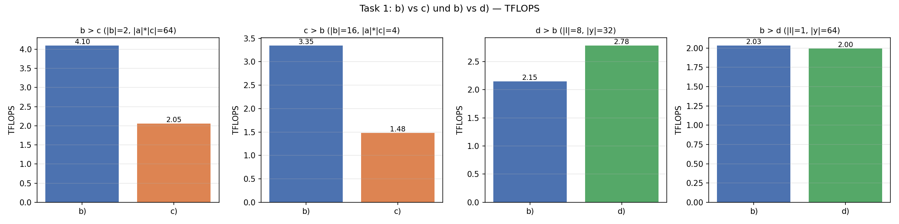
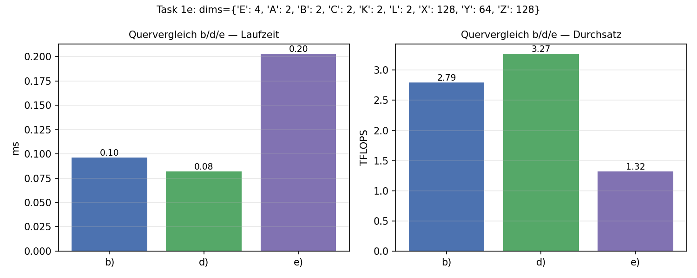

.. _ch04_loesung:

############################################
Report: Tensor Contractions on GPUs
############################################

.. contents:: Inhaltsverzeichnis
   :local:
   :depth: 2

Einleitung
==========

Dieses Kapitel dokumentiert unsere Lösung des vierten Assignments:
*Tensor Contractions on GPUs*. Im Mittelpunkt stehen cuTile-Kernels für
allgemeine Tensor-Kontraktionen mit FP16-Inputs und FP32-Akkumulator –
mit Fokus auf Parallelisierungs-Strategien, Primitive-Size-Merging
und Kernel-Fusion.

Task 1: Tiled Contraction Kernel Variants
==========================================

Aufgabenstellung
-----------------

Implementiert werden vier Varianten eines cuTile-Kernels für die
Kontraktion

.. math::

   C_{eabcxz} = \sum_{k,l,y} A_{eabklxy} \cdot B_{ecklyz}

mit FP16-Inputs/Outputs und FP32-Akkumulator. Variiert wird, welche
Dimensionen als GEMM-Dimensionen (GEneral Matrix-Matrix multiplication) ans ``ct.mma`` gehen und welche
sequentialisiert bzw. parallelisiert werden. Verifikation gegen
``torch.einsum``; Benchmark mit ``triton.testing.do_bench``.

Die Aufgabe ist genau die *Tiled Contraction* aus den Vorlesungsfolien
04 (Folien 13–23): statt das Tensor-Produkt per
*Transpose-Transpose-GEMM-Transpose* (TTGT, Folien 9–12) erst in eine
2D-Matmul zu reshapen, identifizieren wir Tiles direkt im
mehr-dimensionalen Tensor und lassen einen einzigen Kernel über die
restlichen Dimensionen schleifen oder das Grid aufspannen. Das spart
die TTGT-Permutationen im globalen Speicher (Folie 12, Cons:
*„Permutation in memory is expensive"*); im Gegenzug muss der Kernel
selbst die richtige Tile-Geometrie wählen – genau das ist der
Spielraum von b)/c)/d)/e).

Task 1a: Klassifikation der Dimensionen
----------------------------------------

Die einsum-Signatur ``eabklxy, ecklyz -> eabcxz`` lässt sich
nach den klassischen GEMM-/Tensor-Kontraktions-Rollen einordnen
(Folie 8, *„Index Types in Einsum Expressions"*: M = frei in A,
N = frei in B, K = kontrahiert, C/B = Batch in beiden Inputs und
im Output):

.. list-table::
   :header-rows: 1
   :widths: 20 15 30 35

   * - Index
     - Typ
     - Vorkommen
     - Rolle
   * - ``e``
     - **B (Batch)**
     - A, B, C
     - Externe/Batch-Dimension – in jedem Tensor identisch
   * - ``a``, ``b``, ``x``
     - **M**
     - A, C (nicht B)
     - Output-Zeilen-Dim, frei für Parallelisierung oder Tiling
   * - ``c``, ``z``
     - **N**
     - B, C (nicht A)
     - Output-Spalten-Dim, frei für Parallelisierung oder Tiling
   * - ``k``, ``l``, ``y``
     - **K**
     - A, B (nicht C)
     - Kontrahierte Dim – wird im Kernel akkumuliert

Damit gibt es **eine** Batch-Dim, **drei** M-Dims, **zwei** N-Dims und
**drei** K-Dims. Die folgenden Varianten unterscheiden sich darin,
welche dieser K- und M-Dims auf das ``ct.mma`` abgebildet werden und
welche im Kernel als Schleife laufen.

Folie 23 (*„cuTile Tensor Contraction"*) zeigt für genau dieses
Beispiel (ohne ``e``, also ``abklxy, cklyz -> abcxz``) vier
Pseudocode-Skizzen mit aufsteigender mma-K-Dim:
``(x, z, y)`` → ``(x, z, y)`` mit a sequentialisiert →
``(x, z, y·l)`` → ``(x, z, y·l·k)``. Die Aufgabe greift die ersten
drei davon auf (b/c/d), ergänzt um eine Batch-Dim ``e`` und eine
zusätzliche 4. Variante (e), die ``e`` direkt als mma-Batch-Achse
nutzt.

Task 1b: GEMM = (x, y, z), parallel (e, a, b, c)
-------------------------------------------------

Entspricht Folie 23, *erste* Skizze: ``Decompose pid -> (abc)``,
äußere Schleifen ``for k, for l``, mma-Shape ``(x, z, y)`` – plus die
zusätzliche Batch-Dim ``e``, die wir mit in das Grid falten.

**Mapping**

* GEMM-Dimensionen: ``x`` (M), ``y`` (K), ``z`` (N)
* Sequentialisiert (Schleifen im Kernel): ``k``, ``l`` und Tiles
  entlang ``y``
* Parallelisiert (über das Grid): ``e``, ``a``, ``b``, ``c`` sowie
  Tiles entlang ``x`` und ``z``

Das Grid ist 3D:
``(E·A, B·C, ⌈X/tx⌉·⌈Z/tz⌉)``. Innerhalb des Kernels werden die
Block-IDs in die jeweiligen Indizes zerlegt:

.. code-block:: python

   bid_eA = ct.bid(0)
   bid_BC = ct.bid(1)
   bid_xz = ct.bid(2)

   pid_e = bid_eA // Ad
   pid_a = bid_eA %  Ad
   pid_b = bid_BC // Cd
   pid_c = bid_BC %  Cd
   pid_x = bid_xz // num_tiles_z
   pid_z = bid_xz %  num_tiles_z

**Kernel-Kern**

.. code-block:: python

   acc = ct.full((tx, tz), 0, dtype=ct.float32)
   for kk in range(K):
       for ll in range(L):
           for yy in range(num_tiles_y):
               a_tile = ct.load(A,
                   index=(pid_e, pid_a, pid_b, kk, ll, pid_x, yy),
                   shape=(1, 1, 1, 1, 1, tx, ty),
                   padding_mode=ct.PaddingMode.ZERO)
               b_tile = ct.load(B,
                   index=(pid_e, pid_c, kk, ll, yy, pid_z),
                   shape=(1, 1, 1, 1, ty, tz),
                   padding_mode=ct.PaddingMode.ZERO)
               a2d = ct.reshape(a_tile, (tx, ty))
               b2d = ct.reshape(b_tile, (ty, tz))
               acc = ct.mma(a2d, b2d, acc)

   out = ct.reshape(ct.astype(acc, C.dtype), (1, 1, 1, 1, tx, tz))
   ct.store(C, index=(pid_e, pid_a, pid_b, pid_c, pid_x, pid_z), tile=out)

Die Singleton-Dimensionen werden per ``ct.reshape`` weggedrückt; das
``ct.mma`` arbeitet auf reinen 2D-Tiles ``(tx, ty) × (ty, tz) → (tx, tz)``.
Out-of-bounds-Anteile (z. B. wenn ``Y`` kein Vielfaches von ``ty`` ist)
sind durch ``PaddingMode.ZERO`` neutral für die Akkumulation.

Task 1c: zusätzlich b sequentialisiert
---------------------------------------

Entspricht Folie 23, *zweite* Skizze: ``Decompose pid -> (bc)``,
zusätzlich eine ``for a_it``-Schleife im Kernel. In unserer Notation
heißt die sequentialisierte Achse ``b`` statt ``a``, das Prinzip ist
dasselbe – eine M-Dim wandert vom Grid in eine innere Schleife.

**Mapping**

* GEMM-Dimensionen: ``x``, ``y``, ``z`` (wie b)
* Sequentialisiert: ``k``, ``l``, Tiles entlang ``y``, **zusätzlich
  ``b``**
* Parallelisiert: ``e``, ``a``, ``c`` sowie Tiles entlang ``x``, ``z``

Das Grid schrumpft um den Faktor ``|b|``: ``(E·A, C, ⌈X/tx⌉·⌈Z/tz⌉)``.
Jeder Block produziert nun ``|b|`` Output-Tiles (entlang ``b``)
sequentiell. Der Trick: das B-Tile ``B[e,c,k,l,y,z]`` hängt **nicht**
von ``b`` ab und wird daher zwischen den ``b``-Iterationen im L2
wiederverwendet.

**Kernel-Kern**

.. code-block:: python

   for bb in range(Bd):
       acc = ct.full((tx, tz), 0, dtype=ct.float32)
       for kk in range(K):
           for ll in range(L):
               for yy in range(num_tiles_y):
                   a_tile = ct.load(A,
                       index=(pid_e, pid_a, bb, kk, ll, pid_x, yy),
                       shape=(1, 1, 1, 1, 1, tx, ty),
                       padding_mode=ct.PaddingMode.ZERO)
                   b_tile = ct.load(B,
                       index=(pid_e, pid_c, kk, ll, yy, pid_z),
                       shape=(1, 1, 1, 1, ty, tz),
                       padding_mode=ct.PaddingMode.ZERO)
                   acc = ct.mma(ct.reshape(a_tile, (tx, ty)),
                                ct.reshape(b_tile, (ty, tz)), acc)
       out = ct.reshape(ct.astype(acc, C.dtype), (1, 1, 1, 1, tx, tz))
       ct.store(C, index=(pid_e, pid_a, bb, pid_c, pid_x, pid_z), tile=out)

**Vermutung: Wann ist b) besser, wann c)?**

* ``b)`` könnte vorne liegen, wenn ``|b|`` klein ist (kaum Reuse-Potenzial)
  oder wenn das Grid in c) durch den fehlenden b-Faktor zu klein wird,
  um die SMs zu sättigen.
* ``c)`` könnte vorne liegen, wenn ``|b|`` groß ist (viel B-Tile-Reuse
  über die b-Schleife) **und** ``|e|·|a|·|c|·⌈X/tx⌉·⌈Z/tz⌉`` weiterhin
  groß genug bleibt, um genug Blöcke für die SMs bereitzustellen.

Getestete Konfigurationen (siehe Benchmark-Ergebnisse):

* ``|b|=2``, ``|a|·|c|=64``, GEMM-Dims groß – Erwartung: b) vorne.
* ``|b|=16``, ``|a|·|c|=4`` – Erwartung: c) vorne (mehr Reuse pro
  Block, Grid in b) ist ohnehin sehr groß).

Task 1d: GEMM = (x, y·l, z), l und y gemerged
----------------------------------------------

Entspricht Folie 23, *dritte* Skizze: ``# Matmul shape = (x, z, y * l)``
mit nur noch einer äußeren ``for k``-Schleife. Folie 23 zeigt als vierte
Variante sogar das volle Merging ``(x, z, y·l·k)`` – wir greifen es
hier nicht auf, weil die Aufgabe explizit nur ``y`` und ``l`` zusammen
verlangt.

**Mapping**

* GEMM-Dimensionen: ``x`` (M), ``y·l`` (gemergte K), ``z`` (N)
* Sequentialisiert: ``k``, Tiles entlang ``y``
* Parallelisiert: ``e``, ``a``, ``b``, ``c`` sowie Tiles entlang ``x``, ``z``

Statt ``l`` als Schleife laufen zu lassen, packen wir alle ``L``
Slices direkt in einen einzigen ``ct.mma`` mit GEMM-K-Dim ``L·ty``.
Das hebt die *arithmetic intensity* pro mma-Aufruf, weil pro Mma-Issue
``L`` Mal mehr K-Werte verrechnet werden.

**Permute-Trick**

Die Crux: ``A`` hat Layout ``[..., L, X, Y]``, also liegt ``X`` *zwischen*
``L`` und ``Y``. Ein simples Reshape würde ``(L, X, Y)`` in ``(L·X·Y)``
flachklopfen – wir wollen aber ``(X, L·Y)``. Daher zuerst eine Permutation
``(L, X, Y) → (X, L, Y)``, dann Reshape:

.. code-block:: python

   tly = L * ty   # gemergte K-Dim Groesse pro mma

   for kk in range(K):
       for yy in range(num_tiles_y):
           # A: load (..., L, tx, ty) -> permute (tx, L, ty) -> reshape (tx, L*ty)
           a_tile = ct.load(A,
               index=(pid_e, pid_a, pid_b, kk, 0, pid_x, yy),
               shape=(1, 1, 1, 1, L, tx, ty),
               padding_mode=ct.PaddingMode.ZERO)
           a_tile = ct.reshape(a_tile, (L, tx, ty))
           a_tile = ct.permute(a_tile, (1, 0, 2))
           a_tile = ct.reshape(a_tile, (tx, tly))

           # B: hat schon Layout (..., L, Y, Z) -> direkt (L*ty, tz) reshapen
           b_tile = ct.load(B,
               index=(pid_e, pid_c, kk, 0, yy, pid_z),
               shape=(1, 1, 1, L, ty, tz),
               padding_mode=ct.PaddingMode.ZERO)
           b_tile = ct.reshape(b_tile, (tly, tz))

           acc = ct.mma(a_tile, b_tile, acc)

Auf B-Seite ist kein Permute nötig, weil die Reihenfolge ``L, Y, Z``
bereits zur gewünschten Mergung ``L·Y`` passt.

**Vermutung: Wann ist b) besser, wann d)?**

* ``d)`` könnte vorne liegen, wenn ``|l|`` groß ist – jeder mma macht
  dann ``L``-mal so viel Arbeit, ohne dass ``L`` zusätzliche
  Loop-Iterationen und ``ct.load``-Aufrufe nötig wären. Insbesondere
  bei kleinem ``|y|`` (sonst dominiert die y-Schleife schon) könnte
  der Merge etwas bringen.
* ``b)`` gewinnt, wenn ``|l| = 1`` (oder sehr klein): der Permute kostet
  Register-Bewegung, der gemergte mma ist nicht größer als der
  ungemergte, und b) spart sich den Reshape/Permute komplett.

Getestete Konfigurationen:

* ``|l|=8``, ``|y|=32`` – Erwartung: d) vorne (8 Slices pro mma
  gebündelt, b) hat sehr viele kurze K-Iterationen).
* ``|l|=1``, ``|y|=64`` – Erwartung: b) vorne (kein Mergung möglich,
  Permute in d) ist reiner Overhead).

Task 1e: GEMM = (e, x, y, z) als 3D-mma
----------------------------------------

Diese Variante geht über Folie 23 hinaus: statt ``e`` (die einzige
Batch-/C-Index-Dim aus Folie 8) als Grid-Achse zu nutzen, wandert
sie in den ``ct.mma`` selbst. Konzeptuell entspricht das einer
*Batched Matrix Multiplication* (Folie 3–5): mehrere kleine GEMMs
laufen entlang ``e`` parallel, jetzt aber innerhalb eines einzelnen
mma-Aufrufs statt über das Grid verteilt.

**Mapping**

* GEMM-Dimensionen: ``e`` (Batch des mma), ``x``, ``y``, ``z``
* Sequentialisiert: ``k``, ``l``, Tiles entlang ``y``
* Parallelisiert: ``a``, ``b``, ``c`` sowie Tiles entlang ``e``, ``x``, ``z``

cuTile-``mma`` unterstützt 3D-Operanden, sodass die Batch-Dim direkt
über mehrere SM-Lanes / Mma-Instructions abgedeckt wird, statt ``e``
in den Grid-Index zu falten. Akkumulator ist 3D:

.. code-block:: python

   acc = ct.full((te, tx, tz), 0, dtype=ct.float32)
   for kk in range(K):
       for ll in range(L):
           for yy in range(num_tiles_y):
               a_tile = ct.load(A,
                   index=(pid_e, pid_a, pid_b, kk, ll, pid_x, yy),
                   shape=(te, 1, 1, 1, 1, tx, ty),
                   padding_mode=ct.PaddingMode.ZERO)
               b_tile = ct.load(B,
                   index=(pid_e, pid_c, kk, ll, yy, pid_z),
                   shape=(te, 1, 1, 1, ty, tz),
                   padding_mode=ct.PaddingMode.ZERO)
               acc = ct.mma(ct.reshape(a_tile, (te, tx, ty)),
                            ct.reshape(b_tile, (te, ty, tz)), acc)

Bei ``te = |e|`` deckt ein einziger Block die gesamte Batch-Dim ab;
das Grid wird entsprechend kürzer.

Verifikation
------------

Alle vier Varianten werden gegen ``torch.einsum`` mit FP32-Promotion
und Rückgabe in FP16 verglichen (``atol=2e-1, rtol=2e-2``):

.. code-block:: text

   Task 1 b)/c)/d)/e): Verifikation gegen torch.einsum
     Shapes: A=(2, 2, 2, 2, 2, 64, 64), B=(2, 2, 2, 2, 64, 64), ref=(2, 2, 2, 2, 64, 64)
     kernel_b    allclose=True   max_abs_err=0.0312
     kernel_c    allclose=True   max_abs_err=0.0312
     kernel_d    allclose=True   max_abs_err=0.0312
     kernel_e    allclose=True   max_abs_err=0.0312

Alle vier Kernels liefern denselben ``max_abs_err`` (FP16-Quantisierungs-
rauschen), also numerisch äquivalente Ergebnisse.

Benchmark-Ergebnisse
--------------------

Gemessen mit ``triton.testing.do_bench`` auf der DGX Spark (GB10), FP16-Inputs,
FP32-Akkumulator, GEMM-Tile ``(32, 32, 32)``:

.. list-table:: b) vs c)
   :header-rows: 1
   :widths: 40 15 15 15 15

   * - Konfiguration
     - Variante
     - ms
     - TFLOPS
     - Schneller
   * - ``|b|=2, |a|·|c|=64, X=Y=Z=128`` (FLOPs ≈ 2.15·10⁹)
     - b)
     - 0.524
     - **4.10**
     - **b) (2.0×)**
   * -
     - c)
     - 1.046
     - 2.05
     -
   * - ``|b|=16, |a|·|c|=4, X=Y=Z=128`` (FLOPs ≈ 5.37·10⁸)
     - b)
     - 0.161
     - **3.35**
     - **b) (2.3×)**
   * -
     - c)
     - 0.362
     - 1.48
     -

.. list-table:: b) vs d)
   :header-rows: 1
   :widths: 40 15 15 15 15

   * - Konfiguration
     - Variante
     - ms
     - TFLOPS
     - Schneller
   * - ``|l|=8, |y|=32, X=Z=128`` (FLOPs ≈ 1.07·10⁹)
     - b)
     - 0.500
     - 2.15
     - **d) (1.30×)**
   * -
     - d)
     - 0.386
     - **2.78**
     -
   * - ``|l|=1, |y|=64, X=Z=128`` (FLOPs ≈ 1.07·10⁹)
     - b)
     - 0.528
     - **2.03**
     - b) (≈)
   * -
     - d)
     - 0.538
     - 2.00
     -

.. list-table:: Quervergleich b) / d) / e), ``|e|=4``
   :header-rows: 1
   :widths: 25 15 15 15

   * - Variante
     - ms
     - TFLOPS
     - vs b)
   * - b)
     - 0.096
     - 2.79
     - 1.00×
   * - d)
     - 0.082
     - **3.27**
     - 1.17×
   * - e)
     - 0.203
     - 1.32
     - 0.47×

   Vier Panels: links die zwei b)-vs-c)-Settings, rechts die zwei
   b)-vs-d)-Settings. Pro Konfiguration zeigt der höhere Balken die
   schnellere Variante.

   Quervergleich der drei Varianten b), d) und e) auf einer mittleren
   Konfiguration mit ``|e| = 4``.

Beobachtungen und Vermutungen
------------------------------

**b) vs c) — die "c-vorne"-Konfiguration trifft nicht zu.**
In der Konfiguration mit ``|b|=16, |a|·|c|=4`` gewinnt b) mit 3.35 vs
1.48 TFLOPS, also genau das Gegenteil dessen, was wir erwartet hatten.
Mögliche Vermutungen, die wir aber **nicht** verifiziert haben:

* Das Grid in c) wird sehr klein
  (``|e|·|a|·|c|·⌈X/tx⌉·⌈Z/tz⌉`` = 1·2·2·4·4 = 64 Blöcke), was die
  ~108 SMs des GB10 möglicherweise nicht mehr saturiert.
* Der erhoffte L2-Reuse-Gewinn aus der b-Schleife könnte vom
  Occupancy-Verlust überkompensiert werden.
* Möglich, dass die Konfiguration nicht extrem genug war – mit
  ``|b|`` deutlich größer und ``|e|·|a|·|c|`` größer (sodass das
  c)-Grid weiterhin saturiert) könnte sich das Bild drehen.

**b) vs d) — wie erwartet.**
Bei ``|l|=8, |y|=32`` liegt d) mit ~30 % Vorsprung vorne; bei ``|l|=1``
verschwindet der Vorteil und beide sind im Rauschen gleichauf. Das
passt zur Stoßrichtung von Folie 23: je mehr K-Dims man in den
einzelnen mma-Aufruf hineinfaltet, desto größer wird die innere
GEMM-K und desto besser sollte die Tensor-Core-Auslastung pro mma
sein – aber nur, wenn die zu mergende Dim auch tatsächlich Größe > 1
hat.

**Quervergleich b/d/e — e) ist deutlich langsamer.**
Mit ``|e|=4`` und ``te=2`` produziert e) etwa halb so viele Grid-Blöcke
wie b) und braucht einen 3D-Akkumulator. Vermutungen für die
Performance-Lücke (~2× langsamer als d)):

* Niedrigere Occupancy durch größeren Akkumulator
  (``(te, tx, tz)`` statt ``(tx, tz)``).
* 3D-mma mit ``te=2`` ist eventuell nicht in einer optimalen
  Hardware-Lane (Tensor-Cores bevorzugen typischerweise größere
  Batch-Mantles).
* Bei ``|e|=4`` kostet die Verlagerung von ``e`` aus dem Grid in den
  mma-Batch mehr, als sie bringt – die Variante würde wahrscheinlich
  erst sinnvoll, wenn ``|e|`` so klein ist, dass es als Grid-Achse
  selber Auslastung kostet.

**Absolutes TFLOPS-Niveau (2–4 TFLOPS).**
Niedrig im Vergleich zu Assignment 03 (dort 50+ TFLOPS für
2048³-Matmuls). Vermutung: die getesteten Kontraktionen sind klein
(FLOPs ~10⁹, vergleichbar mit ~700³-Matmul) und werden vermutlich
durch Launch-Overhead und kleines Grid limitiert – konsistent zum
TFLOPS-Plateau-Verhalten aus Assignment 03 für kleine Größen.

Task 2: Kernel Fusion
======================

Aufgabenstellung
-----------------

Task 3: GEMM Dimension Size Sweep
==================================

Aufgabenstellung
-----------------

Beiträge
=========

.. list-table::
   :header-rows: 1
   :widths: 30 70

   * - Person
     - Beitrag
   * - Moritz Martin
     - Implementierung Task 1 (Dimensions-Klassifikation, vier Kernel-Varianten
       mit Verifikation gegen ``torch.einsum`` und Vergleichs-Benchmarks
       b/c bzw. b/d), Sphinx-Report-Abschnitt zu Task 1
   * - Oliver Dietzel
     - TODO
