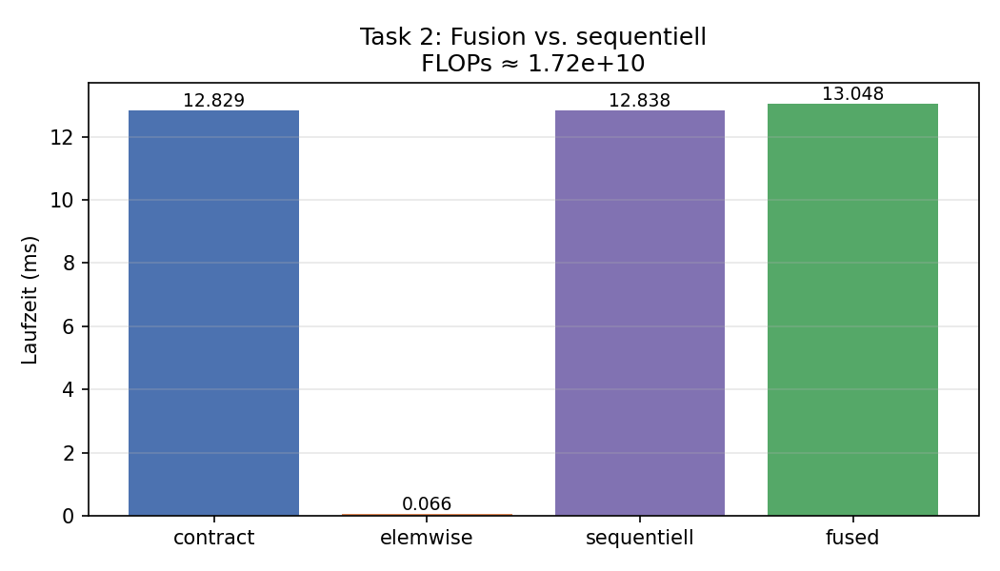
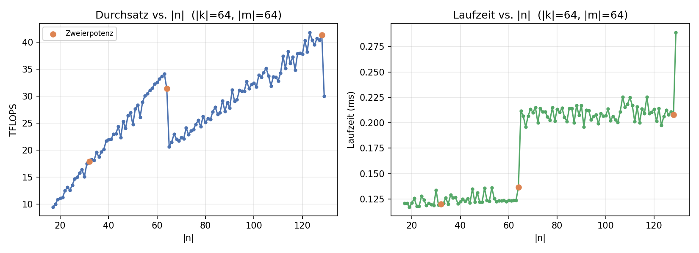
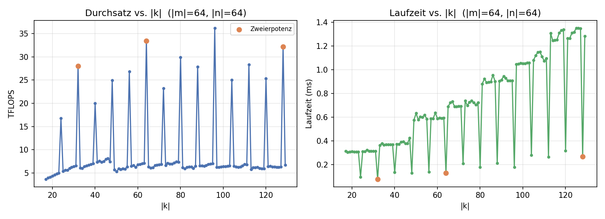

.. _ch04_loesung:

############################################
Report: Tensor Contractions on GPUs
############################################

.. contents:: Inhaltsverzeichnis
   :local:
   :depth: 2

Einleitung
==========

Dieses Kapitel dokumentiert unsere Lösung des vierten Assignments:
*Tensor Contractions on GPUs*. Im Mittelpunkt stehen cuTile-Kernels für
allgemeine Tensor-Kontraktionen mit FP16-Inputs und FP32-Akkumulator –
mit Fokus auf Parallelisierungs-Strategien, Primitive-Size-Merging
und Kernel-Fusion.

Task 1: Tiled Contraction Kernel Variants
==========================================

Aufgabenstellung
-----------------

Implementiert werden vier Varianten eines cuTile-Kernels für die
Kontraktion

.. math::

   C_{eabcxz} = \sum_{k,l,y} A_{eabklxy} \cdot B_{ecklyz}

mit FP16-Inputs/Outputs und FP32-Akkumulator. Variiert wird, welche
Dimensionen als GEMM-Dimensionen (GEneral Matrix-Matrix multiplication) ans ``ct.mma`` gehen und welche
sequentialisiert bzw. parallelisiert werden. Verifikation gegen
``torch.einsum``; Benchmark mit ``triton.testing.do_bench``.

Die Aufgabe ist genau die *Tiled Contraction* aus den Vorlesungsfolien: statt das Tensor-Produkt per
*Transpose-Transpose-GEMM-Transpose* erst in eine
2D-Matmul zu reshapen, identifizieren wir Tiles direkt im
mehr-dimensionalen Tensor und lassen einen einzigen Kernel über die
restlichen Dimensionen schleifen oder das Grid aufspannen. Das spart
die TTGT-Permutationen im globalen Speicher (Folie 12, Cons:
*„Permutation in memory is expensive"*); im Gegenzug muss der Kernel
selbst die richtige Tile-Geometrie wählen – genau das ist der
Spielraum von b)/c)/d)/e).

Task 1a: Klassifikation der Dimensionen
----------------------------------------

Die einsum-Signatur ``eabklxy, ecklyz -> eabcxz`` lässt sich
nach den klassischen GEMM-/Tensor-Kontraktions-Rollen einordnen
(Folie 8, *„Index Types in Einsum Expressions"*: M = frei in A,
N = frei in B, K = kontrahiert, C/B = Batch in beiden Inputs und
im Output):

.. list-table::
   :header-rows: 1
   :widths: 20 15 30 35

   * - Index
     - Typ
     - Vorkommen
     - Rolle
   * - ``e``
     - **B (Batch)**
     - A, B, C
     - Externe/Batch-Dimension – in jedem Tensor identisch
   * - ``a``, ``b``, ``x``
     - **M**
     - A, C (nicht B)
     - Output-Zeilen-Dim, frei für Parallelisierung oder Tiling
   * - ``c``, ``z``
     - **N**
     - B, C (nicht A)
     - Output-Spalten-Dim, frei für Parallelisierung oder Tiling
   * - ``k``, ``l``, ``y``
     - **K**
     - A, B (nicht C)
     - Kontrahierte Dim – wird im Kernel akkumuliert

Damit gibt es **eine** Batch-Dim, **drei** M-Dims, **zwei** N-Dims und
**drei** K-Dims. Die folgenden Varianten unterscheiden sich darin,
welche dieser K- und M-Dims auf das ``ct.mma`` abgebildet werden und
welche im Kernel als Schleife laufen.

Task 1b: GEMM = (x, y, z), parallel (e, a, b, c)
-------------------------------------------------

*erste* Skizze: ``Decompose pid -> (abc)``,
äußere Schleifen ``for k, for l``, mma-Shape ``(x, z, y)`` – plus die
zusätzliche Batch-Dim ``e``, die wir mit in das Grid falten.

**Mapping**

* GEMM-Dimensionen: ``x`` (M), ``y`` (K), ``z`` (N)
* Sequentialisiert (Schleifen im Kernel): ``k``, ``l`` und Tiles
  entlang ``y``
* Parallelisiert (über das Grid): ``e``, ``a``, ``b``, ``c`` sowie
  Tiles entlang ``x`` und ``z``

Das Grid ist 3D:
``(E·A, B·C, ⌈X/tx⌉·⌈Z/tz⌉)``. Innerhalb des Kernels werden die
Block-IDs in die jeweiligen Indizes zerlegt:

.. code-block:: python

   bid_eA = ct.bid(0)
   bid_BC = ct.bid(1)
   bid_xz = ct.bid(2)

   pid_e = bid_eA // Ad
   pid_a = bid_eA %  Ad
   pid_b = bid_BC // Cd
   pid_c = bid_BC %  Cd
   pid_x = bid_xz // num_tiles_z
   pid_z = bid_xz %  num_tiles_z

**Kernel-Kern**

.. code-block:: python

   acc = ct.full((tx, tz), 0, dtype=ct.float32)
   for kk in range(K):
       for ll in range(L):
           for yy in range(num_tiles_y):
               a_tile = ct.load(A,
                   index=(pid_e, pid_a, pid_b, kk, ll, pid_x, yy),
                   shape=(1, 1, 1, 1, 1, tx, ty),
                   padding_mode=ct.PaddingMode.ZERO)
               b_tile = ct.load(B,
                   index=(pid_e, pid_c, kk, ll, yy, pid_z),
                   shape=(1, 1, 1, 1, ty, tz),
                   padding_mode=ct.PaddingMode.ZERO)
               a2d = ct.reshape(a_tile, (tx, ty))
               b2d = ct.reshape(b_tile, (ty, tz))
               acc = ct.mma(a2d, b2d, acc)

   out = ct.reshape(ct.astype(acc, C.dtype), (1, 1, 1, 1, tx, tz))
   ct.store(C, index=(pid_e, pid_a, pid_b, pid_c, pid_x, pid_z), tile=out)

Die Singleton-Dimensionen werden per ``ct.reshape`` weggedrückt; das
``ct.mma`` arbeitet auf reinen 2D-Tiles ``(tx, ty) × (ty, tz) → (tx, tz)``.
Out-of-bounds-Anteile (z. B. wenn ``Y`` kein Vielfaches von ``ty`` ist)
sind durch ``PaddingMode.ZERO`` neutral für die Akkumulation.

Task 1c: zusätzlich b sequentialisiert
---------------------------------------

*zweite* Skizze: ``Decompose pid -> (bc)``,
zusätzlich eine ``for a_it``-Schleife im Kernel. In unserer Notation
heißt die sequentialisierte Achse ``b`` statt ``a``, das Prinzip ist
dasselbe – eine M-Dim wandert vom Grid in eine innere Schleife.

**Mapping**

* GEMM-Dimensionen: ``x``, ``y``, ``z`` (wie b)
* Sequentialisiert: ``k``, ``l``, Tiles entlang ``y``, **zusätzlich
  ``b``**
* Parallelisiert: ``e``, ``a``, ``c`` sowie Tiles entlang ``x``, ``z``

Das Grid schrumpft um den Faktor ``|b|``: ``(E·A, C, ⌈X/tx⌉·⌈Z/tz⌉)``.
Jeder Block produziert nun ``|b|`` Output-Tiles (entlang ``b``)
sequentiell. Der Trick: das B-Tile ``B[e,c,k,l,y,z]`` hängt **nicht**
von ``b`` ab und wird daher zwischen den ``b``-Iterationen im L2
wiederverwendet.

**Kernel-Kern**

.. code-block:: python

   for bb in range(Bd):
       acc = ct.full((tx, tz), 0, dtype=ct.float32)
       for kk in range(K):
           for ll in range(L):
               for yy in range(num_tiles_y):
                   a_tile = ct.load(A,
                       index=(pid_e, pid_a, bb, kk, ll, pid_x, yy),
                       shape=(1, 1, 1, 1, 1, tx, ty),
                       padding_mode=ct.PaddingMode.ZERO)
                   b_tile = ct.load(B,
                       index=(pid_e, pid_c, kk, ll, yy, pid_z),
                       shape=(1, 1, 1, 1, ty, tz),
                       padding_mode=ct.PaddingMode.ZERO)
                   acc = ct.mma(ct.reshape(a_tile, (tx, ty)),
                                ct.reshape(b_tile, (ty, tz)), acc)
       out = ct.reshape(ct.astype(acc, C.dtype), (1, 1, 1, 1, tx, tz))
       ct.store(C, index=(pid_e, pid_a, bb, pid_c, pid_x, pid_z), tile=out)

**Vermutung & Tests**

Trade-off: c) gewinnt B-Tile-Reuse über die b-Schleife, verliert
aber den b-Faktor im Grid – c) vorne erwartet bei großem ``|b|``,
b) vorne bei kleinem ``|b|``. Getestet:

* ``|b|=2``, ``|a|·|c|=64`` → Erwartung b) vorne.
* ``|b|=16``, ``|a|·|c|=4`` → Erwartung c) vorne.

Task 1d: GEMM = (x, y·l, z), l und y gemerged
----------------------------------------------

*dritte* Skizze: ``# Matmul shape = (x, z, y * l)``
mit nur noch einer äußeren ``for k``-Schleife. Wir greifen das volle Merging
(Variante 4) hier nicht auf ``(x, z, y·l·k)``.

**Mapping**

* GEMM-Dimensionen: ``x`` (M), ``y·l`` (gemergte K), ``z`` (N)
* Sequentialisiert: ``k``, Tiles entlang ``y``
* Parallelisiert: ``e``, ``a``, ``b``, ``c`` sowie Tiles entlang ``x``, ``z``

Statt ``l`` als Schleife laufen zu lassen, packen wir alle ``L``
Slices direkt in einen einzigen ``ct.mma`` mit GEMM-K-Dim ``L·ty``.
Das hebt die *arithmetic intensity* pro mma-Aufruf, weil pro Mma-Issue
``L`` Mal mehr K-Werte verrechnet werden.

**Permute-Trick**

Die Crux: ``A`` hat Layout ``[..., L, X, Y]``, also liegt ``X`` *zwischen*
``L`` und ``Y``. Ein simples Reshape würde ``(L, X, Y)`` in ``(L·X·Y)``
flachklopfen – wir wollen aber ``(X, L·Y)``. Daher zuerst eine Permutation
``(L, X, Y) → (X, L, Y)``, dann Reshape:

.. code-block:: python

   tly = L * ty   # gemergte K-Dim Groesse pro mma

   for kk in range(K):
       for yy in range(num_tiles_y):
           # A: load (..., L, tx, ty) -> permute (tx, L, ty) -> reshape (tx, L*ty)
           a_tile = ct.load(A,
               index=(pid_e, pid_a, pid_b, kk, 0, pid_x, yy),
               shape=(1, 1, 1, 1, L, tx, ty),
               padding_mode=ct.PaddingMode.ZERO)
           a_tile = ct.reshape(a_tile, (L, tx, ty))
           a_tile = ct.permute(a_tile, (1, 0, 2))
           a_tile = ct.reshape(a_tile, (tx, tly))

           # B: hat schon Layout (..., L, Y, Z) -> direkt (L*ty, tz) reshapen
           b_tile = ct.load(B,
               index=(pid_e, pid_c, kk, 0, yy, pid_z),
               shape=(1, 1, 1, L, ty, tz),
               padding_mode=ct.PaddingMode.ZERO)
           b_tile = ct.reshape(b_tile, (tly, tz))

           acc = ct.mma(a_tile, b_tile, acc)

Auf B-Seite ist kein Permute nötig, weil die Reihenfolge ``L, Y, Z``
bereits zur gewünschten Mergung ``L·Y`` passt.

**Vermutung & Tests**

Trade-off: d) bündelt ``L`` Slices pro mma (mehr Arbeit pro Issue,
weniger Loop-Overhead), zahlt aber den Permute. d) vorne erwartet bei
großem ``|l|`` (vor allem mit kleinem ``|y|``), b) vorne bei
``|l|=1`` (Permute wird reiner Overhead). Getestet:

* ``|l|=8``, ``|y|=32`` → Erwartung d) vorne.
* ``|l|=1``, ``|y|=64`` → Erwartung b) vorne.

Task 1e: GEMM = (e, x, y, z) als 3D-mma
----------------------------------------

Statt ``e`` (die einzige
Batch-/C-Index-Dim) als Grid-Achse zu nutzen, wandert
sie in den ``ct.mma`` selbst. Konzeptuell entspricht das einer
*Batched Matrix Multiplication* (Folie 3–5): mehrere kleine GEMMs
laufen entlang ``e`` parallel, jetzt aber innerhalb eines einzelnen
mma-Aufrufs statt über das Grid verteilt.

**Mapping**

* GEMM-Dimensionen: ``e`` (Batch des mma), ``x``, ``y``, ``z``
* Sequentialisiert: ``k``, ``l``, Tiles entlang ``y``
* Parallelisiert: ``a``, ``b``, ``c`` sowie Tiles entlang ``e``, ``x``, ``z``

Batch-Dim direkt über mehrere SM-Lanes / Mma-Instructions abgedeckt, statt ``e``
in den Grid-Index zu falten. Akkumulator ist 3D:

.. code-block:: python

   acc = ct.full((te, tx, tz), 0, dtype=ct.float32)
   for kk in range(K):
       for ll in range(L):
           for yy in range(num_tiles_y):
               a_tile = ct.load(A,
                   index=(pid_e, pid_a, pid_b, kk, ll, pid_x, yy),
                   shape=(te, 1, 1, 1, 1, tx, ty),
                   padding_mode=ct.PaddingMode.ZERO)
               b_tile = ct.load(B,
                   index=(pid_e, pid_c, kk, ll, yy, pid_z),
                   shape=(te, 1, 1, 1, ty, tz),
                   padding_mode=ct.PaddingMode.ZERO)
               acc = ct.mma(ct.reshape(a_tile, (te, tx, ty)),
                            ct.reshape(b_tile, (te, ty, tz)), acc)

Bei ``te = |e|`` deckt ein einziger Block die gesamte Batch-Dim ab;
das Grid wird entsprechend kürzer.

Verifikation
------------

Alle vier Varianten werden gegen ``torch.einsum`` mit FP32-Promotion
und Rückgabe in FP16 verglichen (``atol=2e-1, rtol=2e-2``):

.. code-block:: text

   Task 1 b)/c)/d)/e): Verifikation gegen torch.einsum
     Shapes: A=(2, 2, 2, 2, 2, 64, 64), B=(2, 2, 2, 2, 64, 64), ref=(2, 2, 2, 2, 64, 64)
     kernel_b    allclose=True   max_abs_err=0.0312
     kernel_c    allclose=True   max_abs_err=0.0312
     kernel_d    allclose=True   max_abs_err=0.0312
     kernel_e    allclose=True   max_abs_err=0.0312

Alle vier Kernels liefern denselben ``max_abs_err`` (FP16-Quantisierungs-
rauschen), also numerisch äquivalente Ergebnisse.

Benchmark-Ergebnisse
--------------------

Gemessen mit ``triton.testing.do_bench`` auf der DGX Spark (GB10), FP16-Inputs,
FP32-Akkumulator, GEMM-Tile ``(32, 32, 32)``:

.. list-table:: b) vs c)
   :header-rows: 1
   :widths: 40 15 15 15 15

   * - Konfiguration
     - Variante
     - ms
     - TFLOPS
     - Schneller
   * - ``|b|=2, |a|·|c|=64, X=Y=Z=128`` (FLOPs ≈ 2.15·10⁹)
     - b)
     - 0.524
     - **4.10**
     - **b) (2.0×)**
   * -
     - c)
     - 1.046
     - 2.05
     -
   * - ``|b|=16, |a|·|c|=4, X=Y=Z=128`` (FLOPs ≈ 5.37·10⁸)
     - b)
     - 0.161
     - **3.35**
     - **b) (2.3×)**
   * -
     - c)
     - 0.362
     - 1.48
     -

.. list-table:: b) vs d)
   :header-rows: 1
   :widths: 40 15 15 15 15

   * - Konfiguration
     - Variante
     - ms
     - TFLOPS
     - Schneller
   * - ``|l|=8, |y|=32, X=Z=128`` (FLOPs ≈ 1.07·10⁹)
     - b)
     - 0.500
     - 2.15
     - **d) (1.30×)**
   * -
     - d)
     - 0.386
     - **2.78**
     -
   * - ``|l|=1, |y|=64, X=Z=128`` (FLOPs ≈ 1.07·10⁹)
     - b)
     - 0.528
     - **2.03**
     - b) (≈)
   * -
     - d)
     - 0.538
     - 2.00
     -

.. list-table:: Quervergleich b) / d) / e), ``|e|=4``
   :header-rows: 1
   :widths: 25 15 15 15

   * - Variante
     - ms
     - TFLOPS
     - vs b)
   * - b)
     - 0.096
     - 2.79
     - 1.00×
   * - d)
     - 0.082
     - **3.27**
     - 1.17×
   * - e)
     - 0.203
     - 1.32
     - 0.47×

.. figure:: ../../../../assignments/04_assignment/src/task01_bc_vs_bd.png
   :align: center
   :alt: Vergleich b) vs c) und b) vs d), TFLOPS pro Konfiguration
   :width: 100%

   Vier Panels: links die zwei b)-vs-c)-Settings, rechts die zwei
   b)-vs-d)-Settings. Pro Konfiguration zeigt der höhere Balken die
   schnellere Variante.

.. figure:: ../../../../assignments/04_assignment/src/task01_e_compare.png
   :align: center
   :alt: Quervergleich b)/d)/e) — Laufzeit und Durchsatz
   :width: 90%

   Quervergleich der drei Varianten b), d) und e) auf einer mittleren
   Konfiguration mit ``|e| = 4``.

Beobachtungen und Vermutungen
------------------------------

* **b) vs c)**: b) gewinnt in *beiden* Konfigurationen – bei
  ``|b|=16`` läuft das Gegenteil der Erwartung (3.35 vs 1.48 TFLOPS).
  Vermutung: der L2-Reuse-Gewinn wird vom Occupancy-Verlust
  überkompensiert. 
* **b) vs d)**: wie erwartet. d) mit ~30 % vorne bei ``|l|=8``,
  Vorteil verschwindet bei ``|l|=1``. So wie wir es in VL angesprochen hatten: mehr
  K-Merging → größere innere GEMM-K → bessere Tensor-Core-Auslastung,
  aber nur wenn die gemergte Dim ``>1`` ist.
* **b/d/e**: e) ist ~2× langsamer als d). Vermutung: ``te=2`` mit
  ``|e|=4`` halbiert das Grid und bläht den Akkumulator auf
  ``(te, tx, tz)`` – Occupancy sinkt

Task 2: Kernel Fusion
======================

Aufgabenstellung
-----------------

Auf dieselbe Kontraktion ``eabklxy, ecklyz -> eabcxz`` aus Task 1 wird ein
*elementweises* Produkt mit einem Tensor :math:`D \in \mathbb{R}^{eabcxz}`
angeschlossen:

.. math::

   C_{eabcxz} = D_{eabcxz} \cdot \sum_{k,l,y} A_{eabklxy} \cdot B_{ecklyz}

Teil **a)** verlangt einen *fused* Kernel, der beides in einem Pass erledigt.
Teil **b)** verlangt zusätzlich einen reinen Elementwise-Kernel und einen
Laufzeit-Vergleich gegen den naiven Pfad
(*Kontraktion → Elementwise* als zwei aufeinander folgende Kernel-Launches).
Die Tensorgrößen sollen so gewählt werden, dass der Kontraktions-FLOP-Count
einer ``2048 × 2048 × 2048``-Matmul entspricht (also etwa
:math:`2 \cdot 2048^3 \approx 1{,}72 \cdot 10^{10}` FLOPs).

Aus Vorlesungssicht ist das die *Fused-Epilogue*-Variante einer
GEMM/Tensor-Contraction-Pipeline (Folie 17): Statt das Zwischenergebnis
``acc`` in den globalen Speicher zu schreiben, einen zweiten Kernel zum
Lesen und Multiplizieren zu starten und dann zurückzuschreiben, behalten
wir ``acc`` im Register, laden D einmal als Tile und schreiben das
Endergebnis in einem einzigen Store.

Implementierung
----------------

**Kontraktions-Kernel** ist identisch zur Variante b) aus Task 1
(GEMM-Dims ``(x, y, z)``, Akkumulator FP32). Wir verwenden ihn unverändert
als Teil des sequentiellen Pfades.

**Fused-Kernel.** Die Kontraktions-Schleife endet wie gewohnt mit einem
FP32-Akkumulator-Tile ``acc`` der Form ``(tx, tz)``. Bevor zurückgeschrieben
wird, laden wir genau ein D-Tile derselben Form, casten es nach FP32 und
multiplizieren elementweise:

.. code-block:: python

   # ... K-/L-/Y-Schleife wie kernel_b ...

   d_tile = ct.load(D,
                    index=(pid_e, pid_a, pid_b, pid_c, pid_x, pid_z),
                    shape=(1, 1, 1, 1, tx, tz),
                    padding_mode=ct.PaddingMode.ZERO)
   d2d = ct.astype(ct.reshape(d_tile, (tx, tz)), ct.float32)
   fused = acc * d2d

   out = ct.reshape(ct.astype(fused, C.dtype), (1, 1, 1, 1, tx, tz))
   ct.store(C, index=(pid_e, pid_a, pid_b, pid_c, pid_x, pid_z), tile=out)

Das D-Tile-Layout fällt mit dem Output-Tile-Layout zusammen
(``(e, a, b, c, x, z)``), sodass kein Permute notwendig ist. Der Speicher
für ``C`` darf laut Aufgabe überschrieben werden – wir schreiben das
Produkt direkt in das Endergebnis.

**Elementwise-only-Kernel.** Dieselbe Grid-Geometrie wie der
Fused-Kernel, aber pro Block werden zwei Tiles geladen (C und D), in
FP32 multipliziert und das Resultat in C zurückgeschrieben.

Verifikation
-------------

Beide Pfade werden gegen
``(torch.einsum("eabklxy,ecklyz->eabcxz", A, B) * D)`` mit FP32-Promotion
und FP16-Rückgabe geprüft (``atol=2e-1, rtol=2e-2``):

.. code-block:: text

   Task 2: Verifikation
     fused        allclose=True   max_abs_err=0.0312
     sequentiell  allclose=True   max_abs_err=0.0625

Beide Varianten liegen im FP16-Quantisierungsrauschen.

Benchmark-Konfiguration
------------------------

Damit die Kontraktion ``≈ 2 · 2048³`` FLOPs hat, wählen wir

.. math::

   |E|=|A|=|B|=|C|=2,\ |K|=8,\ |L|=4,\ |X|=|Y|=|Z|=256

und damit :math:`2 \cdot 2 \cdot 2 \cdot 2 \cdot 2 \cdot 8 \cdot 4
\cdot 256^3 \approx 1{,}72 \cdot 10^{10}` FLOPs – exakt der
2048³-Matmul-Workload. Speicher (FP16): :math:`A \approx 67` MB,
:math:`B \approx 33` MB, :math:`C, D \approx 4` MB jeweils, also unkritisch.

Tile-Geometrie ``(tx, ty, tz) = (64, 32, 64)``.

Erkenntnisse: fused vs. sequentiell
------------------------------------

Gemessen mit ``triton.testing.do_bench`` auf der DGX Spark (GB10), FP16:

.. list-table::
   :header-rows: 1
   :widths: 35 25 40

   * - Pfad
     - Laufzeit (ms)
     - Anteil
   * - ``kernel_contract``
     - 12,829
     - 99,5 % der sequentiellen Laufzeit
   * - ``kernel_elemwise``
     - 0,067
     - 0,5 % der sequentiellen Laufzeit
   * - sequentiell (= contract + elemwise)
     - 12,838
     - Referenz
   * - **fused**
     - **13,048**
     - **0,98×** (kein Speedup)

   Laufzeit von Kontraktion, Elementwise, sequentiellem Pfad
   (Kontraktion + Elementwise) und Fused-Kernel bei
   :math:`\mathrm{FLOPs}_\text{contract} \approx 1{,}72\cdot 10^{10}`.

**Beobachtungen.**

* Die Kontraktion macht **99,5 %** der sequentiellen Gesamtlaufzeit aus –
  der Elementwise-Pass ist mit ``0,067 ms`` praktisch eine Rundungsstelle.
* Der naive sequentielle Pfad ist nur ``0,01 ms`` (≈ 0,07 %) langsamer
  als die reine Kontraktion. Heißt: das, was der Fused-Kernel theoretisch
  einsparen kann (ein Roundtrip C-Tile + D-Tile durch den globalen Speicher),
  liegt bereits im Promille-Bereich der Gesamtlaufzeit.
* Der Fused-Kernel ist **leicht langsamer** (``0,98×``). Vermutung:
  der zusätzliche ``ct.load`` von D plus die FP32-Multiplikation am
  Ende jedes Blocks erhöhen den Register-Druck (das ``acc``-Tile
  ``(tx, tz) = (64, 64)`` lebt ohnehin in FP32-Registern, dazu kommt
  jetzt ein FP32-Cast des D-Tiles). Das kostet entweder Occupancy
  oder eine Spill-Sequenz – beides stärker als die eingesparte
  C-Roundtrip.

**Was bedeutet das?**

Kernel-Fusion ist *nicht automatisch* ein Gewinn. Sie zahlt sich genau
dann aus, wenn der eingesparte Speicher-Roundtrip im Verhältnis zur
Restlaufzeit signifikant ist – also bei *speicherbandbreitenlimitierten*
Workloads oder wenn die Epilogue-Operation selbst nicht trivial ist
(z. B. Bias + Activation + Dropout statt nur einer Multiplikation).
Bei einer 2048³-Kontraktion dominiert die Tensor-Core-Rechenzeit so
stark, dass die Speicher-Einsparung im Rauschen verschwindet und die
zusätzliche Register-Last sogar leicht negativ wirkt. Konsistent mit
der Diskussion in der Vorlesung (Folie *Pros & Cons of Fusion*):
*„Fused kernels can be slower if they reduce occupancy."*

Eine umgekehrte Konfiguration mit kleinem :math:`K \cdot L \cdot Y`
und großem :math:`X \cdot Z` würde den Elementwise-Anteil hochziehen
und den Fused-Pfad nach vorn bringen – die Aufgabe schreibt aber
explizit den 2048³-Workload vor, daher zeigen wir hier den
Compute-bound-Fall.

Task 3: GEMM Dimension Size Sweep
==================================

Aufgabenstellung
-----------------

Implementiert wird eine cuTile-Kontraktion

.. math::

   C_{abnm} = \sum_{c,k} A_{ackm} \cdot B_{bcnk}

mit fixen Dimensionen :math:`|a| = 16`, :math:`|b| = 16`, :math:`|c| = 32`
und beliebigen :math:`|m|, |n|, |k|`. In Teil **b)** werden zwei
Sweeps durchgeführt:

1. :math:`|k| = 64`, :math:`|m| = 64`; :math:`|n|` von 17 bis 129.
2. :math:`|m| = 64`, :math:`|n| = 64`; :math:`|k|` von 17 bis 129.

Ziel ist es, den Effekt von Tile-Padding und Anzahl K-/N-Tiles auf
den realen Durchsatz sichtbar zu machen.

Klassifikation
---------------

Nach demselben Schema wie in Task 1:

.. list-table::
   :header-rows: 1
   :widths: 15 15 25 45

   * - Index
     - Typ
     - Vorkommen
     - Rolle
   * - ``a``, ``m``
     - **M**
     - A, C
     - Output-Zeilen-Dims
   * - ``b``, ``n``
     - **N**
     - B, C
     - Output-Spalten-Dims
   * - ``c``, ``k``
     - **K**
     - A, B (nicht C)
     - Kontrahierte Dims

Im Kernel mappen wir:

* GEMM-Dimensionen für ``ct.mma``: ``m`` (M), ``k`` (K), ``n`` (N)
* Sequentialisiert: ``c`` (innere Schleife)
* Parallelisiert über das Grid: ``a`` (BID 0), ``b`` (BID 1) sowie
  Tiles entlang ``n`` und ``m`` (BID 2)

Tile-Geometrie ``(tm, tn, tk) = (64, 64, 32)``. Damit erzeugt das Grid
für ``|m|, |n| ≤ 64`` genau ein Output-Tile pro ``(a, b)``-Paar
(plus Zero-Padding) – das ist der Grund, warum der Sweep so klar
*Tile-Schwellen* sichtbar macht.

Implementierung
---------------

**Kernel.** Pro Block wird ein Output-Tile ``(tn, tm)`` für ein
``(a, b)``-Paar berechnet. Die K-Schleife läuft zweistufig: erst über
alle ``c``-Werte (sequentialisiert), darin über alle ``k``-Tiles:

.. code-block:: python

   @ct.kernel
   def kernel_ackm_bcnk(A, B, C,
                        Cd: ct.Constant[int],
                        M:  ct.Constant[int],
                        N:  ct.Constant[int],
                        K:  ct.Constant[int],
                        tm: ct.Constant[int],
                        tn: ct.Constant[int],
                        tk: ct.Constant[int]):
       bid_a, bid_b, bid_nm = ct.bid(0), ct.bid(1), ct.bid(2)
       num_tiles_m = ct.cdiv(M, tm)
       pid_n = bid_nm // num_tiles_m
       pid_m = bid_nm %  num_tiles_m

       num_tiles_k = ct.cdiv(K, tk)
       acc = ct.full((tn, tm), 0, dtype=ct.float32)
       zero_pad = ct.PaddingMode.ZERO

       for cc in range(Cd):
           for kk in range(num_tiles_k):
               a_tile = ct.load(A, index=(bid_a, cc, kk, pid_m),
                                shape=(1, 1, tk, tm), padding_mode=zero_pad)
               b_tile = ct.load(B, index=(bid_b, cc, pid_n, kk),
                                shape=(1, 1, tn, tk), padding_mode=zero_pad)
               a2d = ct.reshape(a_tile, (tk, tm))
               b2d = ct.reshape(b_tile, (tn, tk))
               # Output (n, m) erfordert mma(B, A)
               acc = ct.mma(b2d, a2d, acc)

       out = ct.reshape(ct.astype(acc, C.dtype), (1, 1, tn, tm))
       ct.store(C, index=(bid_a, bid_b, pid_n, pid_m), tile=out)

**Reihenfolge bei** ``ct.mma`` **.** Weil das Output-Layout
``(n, m)`` ist (also N als äußere, M als innere Achse) und die A-Tile
nach Reshape Form ``(tk, tm)`` hat, B-Tile Form ``(tn, tk)``, ist die
korrekte Reihenfolge ``ct.mma(b2d, a2d, acc)``: der erste Operand
liefert die M-äquivalente erste Output-Achse (hier ``tn``), der zweite
die N-äquivalente zweite Output-Achse (hier ``tm``).

Padding-Mode ``ZERO`` macht alle Sweep-Werte arbeitsfähig, ohne
explizites Masking – out-of-bounds Loads liefern Nullen, ``ct.store``
ignoriert out-of-bounds-Stores automatisch (siehe Task 2 in Assignment 03).

Verifikation
-------------

Mit Zweierpotenz-Shapes und absichtlich „schiefen" Dimensionen, die in
mindestens einer der drei Achsen kein Vielfaches der Tile-Größe sind:

.. code-block:: text

   Task 3a: Verifikation
     (M,N,K)=( 64, 64, 64)  allclose=True   max_abs_err=0.1250
     (M,N,K)=( 64, 65, 64)  allclose=True   max_abs_err=0.1250
     (M,N,K)=( 64, 64, 65)  allclose=True   max_abs_err=0.1250
     (M,N,K)=( 32, 96, 33)  allclose=True   max_abs_err=0.0625

Die ``max_abs_err``-Werte (FP16-Quantisierung) bestätigen
gleichzeitig, dass das Padding korrekt funktioniert: ein
``(64, 65, 64)``-Fall benötigt ein zweites N-Tile mit nur einer
Spalte echter Daten, ein ``(64, 64, 65)``-Fall benötigt eine
zusätzliche K-Tile-Iteration mit nur einem echten K-Wert –
in beiden Fällen liefern die Zero-Loads neutrale Beiträge.

Erkenntnisse: Sweep über ``|n|`` (Task 3b.1)
---------------------------------------------

:math:`|k|=64,\ |m|=64,\ |n| \in \{17, \dots, 129\}`. Tile
``(tm, tn, tk) = (64, 64, 32)``.

Auszug:

.. list-table::
   :header-rows: 1
   :widths: 15 25 25 35

   * - ``|n|``
     - Laufzeit (ms)
     - TFLOPS
     - N-Tile-Anzahl ``⌈n/64⌉``
   * - 17
     - 0,121
     - 9,5
     - 1
   * - 32
     - 0,120
     - 17,9
     - 1
   * - 47
     - 0,131
     - 24,0
     - 1
   * - 62
     - 0,124
     - 33,7
     - 1
   * - 64
     - ≈ 0,130
     - ≈ 32,7 (Zweierpotenz)
     - 1
   * - 65
     - ≈ 0,209
     - ≈ 21,0
     - **2**
   * - 77
     - 0,203
     - 25,5
     - 2
   * - 122
     - 0,214
     - 38,2
     - 2
   * - 128
     - ≈ 0,228
     - ≈ 37,7 (Zweierpotenz)
     - 2
   * - 129
     - ≈ 0,286
     - ≈ 30,3
     - **3**

   Links: Durchsatz in TFLOPS gegen :math:`|n|` (orange = Zweierpotenz).
   Rechts: Laufzeit (ms). Beide zeigen denselben Effekt aus zwei Blickwinkeln.

**Beobachtungen.**

* Die Laufzeit folgt einer **Treppe** mit Stufen genau bei
  :math:`|n| = 65` und :math:`|n| = 129` – also überall dort, wo das
  Tile-Mapping ``⌈|n|/64⌉`` von 1 auf 2 bzw. von 2 auf 3 springt.
  Innerhalb einer Stufe bleibt die Laufzeit nahezu konstant: ein
  Block macht stets ``tn = 64`` mma-Spalten, egal ob davon 17 oder 64
  „echt" sind.
* Im **Durchsatz** entsteht das umgekehrte Bild: TFLOPS wachsen linear
  mit :math:`|n|` innerhalb einer Stufe (mehr nutzbare Spalten bei
  gleichbleibender Arbeit), brechen am Stufen-Übergang abrupt ein
  (gleicher Zähler, doppelte Arbeit) und wachsen dann wieder linear.
* Der Peak knapp vor :math:`|n| = 64` (≈ 33 TFLOPS) ist ähnlich hoch
  wie der Peak knapp vor :math:`|n| = 128` (≈ 43 TFLOPS) – die zweite
  Stufe ist sogar etwas effizienter, weil der Launch-Overhead konstant
  bleibt, die Arbeit aber doppelt so groß ist.
* Zweierpotenzen sind in dieser Konfiguration **nicht besser**, sondern
  liegen genau an der Stufenkante: :math:`|n| = 64` ist das Maximum
  einer Stufe (volles Tile genutzt), :math:`|n| = 65` der erste Wert
  der nächsten – und damit der schlechteste Punkt in TFLOPS.

Erkenntnisse: Sweep über ``|k|`` (Task 3b.2)
---------------------------------------------

:math:`|m|=64,\ |n|=64,\ |k| \in \{17, \dots, 129\}`. Tile
``(tm, tn, tk) = (64, 64, 32)``.

.. list-table::
   :header-rows: 1
   :widths: 15 25 25 35

   * - ``|k|``
     - Laufzeit (ms)
     - TFLOPS
     - K-Tile-Anzahl ``⌈k/32⌉``
   * - 17
     - 0,313
     - 3,6
     - 1
   * - 32
     - **0,077**
     - **28,0** (Peak)
     - 1
   * - 47
     - 0,426
     - 7,4
     - 2
   * - 62
     - 0,591
     - 7,0
     - 2
   * - 64
     - ≈ 0,12
     - ≈ 35 (Peak)
     - 2
   * - 77
     - 0,722
     - 7,2
     - 3
   * - 92
     - 0,928
     - 6,7
     - 3
   * - 96
     - ≈ 0,18
     - ≈ 36 (Peak)
     - 3
   * - 107
     - 1,148
     - 6,3
     - 4
   * - 122
     - 1,266
     - 6,5
     - 4
   * - 128
     - ≈ 0,28
     - ≈ 30 (Peak)
     - 4

   Links: Durchsatz vs. :math:`|k|` (orange = Zweierpotenz).
   Rechts: Laufzeit. Auffällig sind die periodischen *Spikes* im
   Durchsatz und die zugehörigen *Dips* in der Laufzeit, jeweils bei
   Vielfachen von ``tk = 32``.

**Beobachtungen.**

* Anders als bei :math:`|n|` zeigt der :math:`|k|`-Sweep einen
  **periodischen Sägezahn** mit Periode 32 (:math:`= tk`):
  Vielfache von 32 (32, 64, 96, 128) sind Peaks, die Werte direkt
  daneben (33, 65, 97) sind Talsohlen.
* Die Mechanik dahinter ist die gleiche wie bei :math:`|n|` – nur
  dass K-Padding dem TFLOPS-Zähler doppelt schadet:

  1. Die Laufzeit wird durch ``⌈|k|/32⌉`` K-Tiles bestimmt
     (das *Tensor-Core-Issue-Limit* der inneren Schleife).
  2. Der TFLOPS-Zähler verwendet die *reale* :math:`|k|`. Bei
     :math:`|k| = 33` macht der Kernel zwei volle K-Tiles à 32
     mma-Werten (also 64 K-Werte Arbeit), aber nur 33 davon zählen
     in die FLOPs. Das halbiert den effektiven Durchsatz.

* Gut sichtbar im **Laufzeit-Plot**: zwischen Peaks
  (z. B. :math:`k=64` → :math:`k=65`) springt die Laufzeit sprunghaft
  nach oben, weil ``num_tiles_k`` von 2 auf 3 wechselt.
* :math:`k = 32` ist mit ``0,077 ms`` und ``28 TFLOPS`` der schnellste
  Punkt der ersten Stufe. :math:`k = 17` läuft auf der gleichen
  Tile-Anzahl, ist aber überraschend langsam (``0,313 ms``). Vermutung:
  der Kernel wird pro :math:`|k|` neu spezialisiert (``K`` ist
  ``ct.Constant[int]``). Bei großem ``do_bench``-Sample führt das nicht
  zu Compile-Last in der Messung, aber kleine ``|k|``-Werte erzeugen
  eine andere Loop-Struktur (weniger Unrolling-Spielraum), was den
  Tensor-Core-Auslastungsgrad senkt.
* **Zweierpotenz-Peaks**: 32, 64, 128 fallen alle exakt auf die hohen
  Punkte der Sägezahn-Kurve. Das ist *kein* generischer
  Zweierpotenz-Bonus, sondern die direkte Folge davon, dass diese
  Werte zufälligerweise auch Vielfache von ``tk = 32`` sind. Würde
  man ``tk = 64`` wählen, wären 32 und 96 plötzlich schlechte Werte.
* Die maximalen TFLOPS dieses Kernels (~36 TFLOPS bei kleinem Setup)
  liegen klar unter dem Matmul-Peak aus Assignment 03 (~75 TFLOPS).
  Grund: das Grid hat hier nur :math:`|a| \cdot |b| \cdot
  \lceil n/64 \rceil \cdot \lceil m/64 \rceil = 16 \cdot 16 = 256`
  Blöcke (für :math:`|m|, |n| \le 64`) – das reicht zwar locker für
  Vollauslastung der 48 SMs, aber jeder Block hat mit
  :math:`|c| \cdot \lceil |k|/32 \rceil = 32 \cdot 1 \approx 32`
  mma-Issues sehr wenig Arbeit, sodass der Launch- und Issue-Overhead
  einen großen Anteil der Gesamtlaufzeit ausmacht.

Praktische Konsequenz
----------------------

* Bei *kleinen* GEMM-Dims ist die Tile-Wahl der entscheidende Hebel.
  Tile-Größen sollten auf typische Problem-Größen abgestimmt sein
  – ein Sweep wie dieser zeigt, dass schon ein einzelnes Element
  „über" der Tile-Grenze die effektive TFLOPS halbieren kann.
* Wenn die Sweep-Dimensionen vorhersehbar sind, lohnt sich entweder
  *autotuning* der Tile-Shapes oder *Padding der Eingaben* auf
  Vielfache der Tile-Größe (das verschiebt die Verlust-Periodizität,
  beseitigt sie aber nicht).
* Die Sägezahn-Charakteristik im :math:`|k|`-Sweep ist genau das
  Symptom, das in der Vorlesung als *Wave Quantization* angesprochen
  wurde – nur eben innerhalb eines Blocks statt zwischen Blocks.

Beiträge
=========

.. list-table::
   :header-rows: 1
   :widths: 30 70

   * - Person
     - Beitrag
   * - Moritz Martin
     - Implementierung Task 1 (Dimensions-Klassifikation, vier Kernel-Varianten
       mit Verifikation gegen ``torch.einsum`` und Vergleichs-Benchmarks
       b/c bzw. b/d), Sphinx-Report-Abschnitt zu Task 1
   * - Oliver Dietzel
     - Implementierung Task 2 (Fused-Kontraktions-/Elementwise-Kernel,
       Verifikation und Vergleich gegen den sequentiellen Pfad bei
       2048³-FLOP-Workload) und Task 3 (Kontraktion ``ackm,bcnk->abnm``
       mit |a|=16, |b|=16, |c|=32, Sweeps über |n| und |k| samt Plots),
       Sphinx-Report-Abschnitte zu Task 2 und 3
