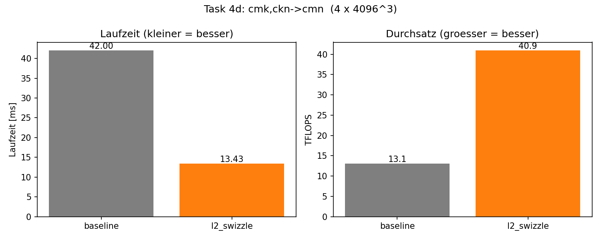
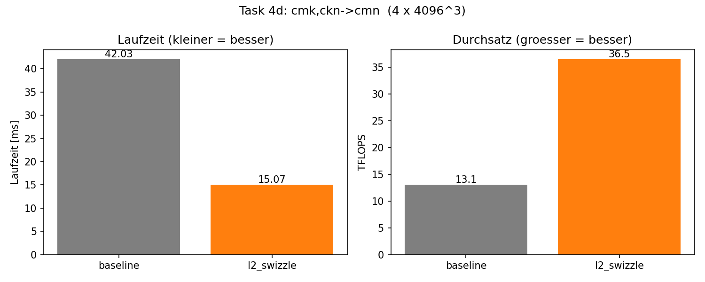
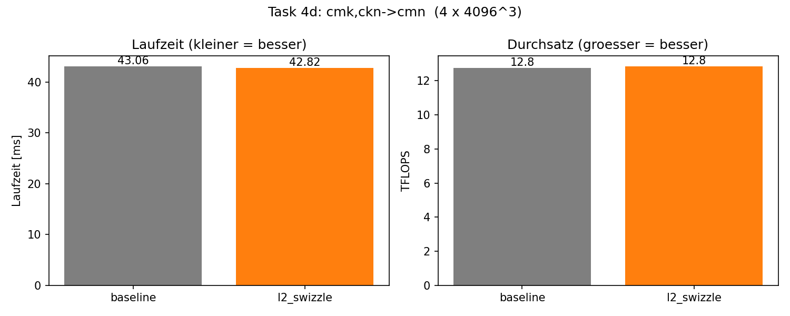

.. _ch05_loesung:

##################################################
Report: Contraction Interface and L2 Optimization
##################################################

.. contents:: Inhaltsverzeichnis
   :local:
   :depth: 2

Einleitung
==========

Dieses Kapitel dokumentiert unsere Lösung des fünften Assignments:
*Contraction Interface and L2 Optimization*. Aufbauend auf den
cuTile-Kernels aus Assignment 04 entwickeln wir ein
Konfigurations-Interface für Tensor-Kontraktionen, einen Optimizer,
der diese Configs transformiert, und nutzen das Ganze, um einen
L2-optimierten cuTile-Kernel für eine batched Matrix-Multiplikation
``cmk, ckn -> cmn`` abzuleiten.

Die Code-Basis ist nach Konzept statt nach Task-Nummer organisiert:

* ``src/config.py`` — Enums + ``Config``-Dataclass + ``generate_config`` (Task 1+2)
* ``src/optimizer.py`` — ``Optimizer``-Klasse (Task 3)
* ``src/kernel.py`` — cuTile-Kernels und Pipeline (Task 4a–c)
* ``src/benchmark.py`` — Verifikation + Benchmark (Task 4d)

Task 1: Config Class
=====================

Aufgabenstellung
-----------------

Ein deklaratives Datenmodell für Tensor-Kontraktionen: Enums für
Dimension-Typen, Execution-Strategien, Primitive- und Datentypen sowie
ein ``Config``-Dataclass, der eine konkrete Kontraktion vollständig
beschreibt.

Implementierung
----------------

Die Enums (``DimType``, ``ExecType``, ``PrimType``, ``LastType``,
``FirstType``, ``DataType``) werden mit ``enum.Enum`` und ``auto()``
definiert — die konkreten numerischen Werte sind irrelevant; was zählt
ist Identitäts-Vergleich (``x == DimType.K``) und ``.name`` für Reports.

Das ``Config``-Dataclass führt acht Felder ohne Default-Werte zusammen.
Jedes per-Dimension-Feld (``dim_types``, ``exec_types``, ``dim_sizes``)
ist eine Liste der Länge :math:`d`; ``strides`` ist eine
Liste-von-Listen, eine innere Liste pro Tensor (Inputs + Output).
**Stride 0 bedeutet: die Dimension kommt in diesem Tensor nicht vor.**
Diese Konvention macht alle per-Tensor-Listen exakt gleich lang und
vereinfacht die Optimizer-Operationen erheblich (kein Sonderfall „Dim
nicht im Tensor").

Task 2: Generating a Basic Config
==================================

Aufgabenstellung
-----------------

Eine Funktion ``generate_config(einsum, shapes)`` soll aus einem
einsum-String und den Eingabe-Shapes automatisch eine Basis-Config
erzeugen.

Implementierung
----------------

Die Klassifikations-Logik folgt der Vorlesung (Folie 8,
*Index Types in Einsum Expressions*):

.. list-table::
   :header-rows: 1
   :widths: 35 25 40

   * - Vorkommen
     - DimType
     - Begründung
   * - in allen Tensoren (inkl. Output)
     - ``C`` (Batch)
     - identisch in allen
   * - nur in Inputs (nicht im Output)
     - ``K``
     - kontrahiert / aufsummiert
   * - in Input 0 + Output, nicht in Input 1
     - ``M``
     - GEMM-Konvention :math:`A \cdot B = C`
   * - in Input 1 + Output, nicht in Input 0
     - ``N``
     - GEMM-Konvention

Die globale Dim-Reihenfolge ergibt sich aus dem **ersten Auftreten**
über Inputs und Output — konsistent mit numpys einsum-Semantik und
deterministisch.

Die Strides werden pro Tensor in **Row-Major-Reihenfolge** berechnet
(innerste Dim → 1, dann nach links akkumulieren) und auf die globale
Dim-Reihenfolge gemappt. Beispiel ``cmk,ckn->cmn`` mit Shapes
:math:`(4, 4096, 4096)` jeweils:

.. code-block:: text

   pos name    type  exec      size     stride_A    stride_B    stride_C
   ----------------------------------------------------------------------
   0   c       C     SEQ          4     16777216    16777216    16777216
   1   m       M     SEQ       4096         4096           0        4096
   2   k       K     SEQ       4096            1        4096           0
   3   n       N     SEQ       4096            0           1           1

Task 3: Optimizer Class
========================

Aufgabenstellung
-----------------

Ein ``Optimizer`` umhüllt eine Config und exponiert fünf
Transformations-Methoden, die Configs deklarativ in eine
cuTile-ausführbare Form überführen.

Task 3a: split_dim
-------------------

Zerlegt eine Dimension in zwei (``outer_size * inner_size == size``,
sonst ``ValueError``). Die Stride-Mathematik:

* Inner-Stride bleibt identisch zum alten Stride.
* Outer-Stride = ``old * inner_size`` (er steppt über ``inner_size``
  Elemente des inneren Strides).
* Stride 0 bleibt 0 für beide neue Dims.

``dim_type`` und ``exec_type`` werden auf beide neuen Dimensionen
vererbt.

Task 3b: fuse_dims
-------------------

Adjacency-Check **pro Tensor**, in dem beide Dims auftauchen
(Stride ≠ 0): entweder ``stride[a] == stride[b] * size[b]`` (a äußere)
oder ``stride[a] * size[a] == stride[b]`` (b äußere). Tensoren, in denen
mindestens eine Dim mit Stride 0 fehlt, werden übersprungen — die
Bedingung „adjacent in jedem Tensor, in dem beide auftauchen" ist
dort trivial erfüllt.

Der neue Stride ist ``min(stride[a], stride[b])`` (innerer Stride),
bzw. der nicht-null Stride wenn nur einer != 0. Der Eintrag ``b`` wird
aus allen Listen entfernt; die ``a``-Position behält automatisch
``dim_type``/``exec_type`` (Vererbung von ``a``).

Sanity-Check: ``split_dim`` gefolgt von ``fuse_dims`` der erzeugten
Dims liefert die ursprüngliche Config (verifiziert in
``optimizer.py``-``__main__``).

Task 3c: permute_dims
----------------------

Umsortierung aller per-Dim-Listen analog ``torch.permute``:
``new[i] = old[permutation[i]]``. Validierung, dass ``permutation``
tatsächlich eine Permutation von ``range(n)`` ist, schützt vor
schwer zu debuggenden Folgefehlern.

Task 3d: make_executable
-------------------------

Heuristik in zwei Schritten:

1. Pro Typ M/N/K wird die **rechteste** passende Dim als ``PRIM``
   markiert. Verbleibende K-Dims werden ``SEQ`` (``PAR`` ist verboten),
   verbleibende M/N/C-Dims werden ``PAR`` (mehr Parallelismus).
2. Stabile Sortierung nach ``(exec_type_rang, original_index)`` mit
   Reihenfolge ``PAR < SEQ < PRIM``. Stabilität ist wichtig — innerhalb
   eines Blocks bleibt die Reihenfolge erhalten, sodass eine vorab
   gesetzte Reihenfolge (z. B. ``[m_l2, n_l2]`` statt ``[n_l2, m_l2]``)
   durchkommt.

Am Ende wird ``verify()`` aufgerufen — der Bauplan ist
bewiesenermaßen ausführbar oder die Methode wirft.

Task 3e: verify
----------------

Vier Bedingungen mit beschreibenden ``ValueError``-Meldungen:

1. Kein K mit ``exec_type=PAR``.
2. Alle ``SEQ`` links von allen ``PRIM``.
3. Alle ``PAR`` links von allen ``SEQ``.
4. ``PRIM`` ist ein zusammenhängender Block ganz rechts und enthält
   mindestens je ein M, N und K.

Bedingung 4 ist die strengste — sie codiert das cuTile-Constraint, dass
``ct.mma`` mindestens einen M-, N- und K-Operanden braucht.

Task 4: L2-Optimized Batched Contraction
=========================================

Aufgabenstellung
-----------------

Für die batched Matmul ``cmk, ckn -> cmn`` mit
:math:`|c| = 4`, :math:`|m| = |n| = |k| = 4096` soll ein
L2-optimierter cuTile-Kernel abgeleitet und gegen ein
naives Baseline-Mapping verglichen werden.

Task 4a: Basis-Config
----------------------

``build_basic_config()`` ist ein Einzeiler, der ``generate_config``
aufruft. Resultat:

.. code-block:: text

   pos name    type  exec      size     stride_A    stride_B    stride_C
   ----------------------------------------------------------------------
   0   c       C     SEQ          4     16777216    16777216    16777216
   1   m       M     SEQ       4096         4096           0        4096
   2   k       K     SEQ       4096            1        4096           0
   3   n       N     SEQ       4096            0           1           1

   data_type=FLOAT16  prim_main=GEMM  prim_last=NONE  prim_first=ZERO

Vier Dimensionen, alle ``SEQ`` — die rohe Beschreibung ohne jegliche
Hardware-Anpassung.

Task 4b: L2-Optimierung
------------------------

Pipeline aus drei Optimizer-Calls plus ``make_executable()``:

.. code-block:: python

   cfg = build_basic_config()
   opt = Optimizer(cfg)
   opt.split_dim(m_id, 64, 64)              # m -> (m_l2, m_prim)
   opt.split_dim(n_id, 64, 64)              # n -> (n_l2, n_prim)
   opt.permute_dims([0, 1, 4, 2, 5, 3])     # Spec-Layout
   opt.make_executable()

Resultat:

.. code-block:: text

   pos name    type  exec      size     stride_A    stride_B    stride_C
   ----------------------------------------------------------------------
   0   c       C     PAR          4     16777216    16777216    16777216
   1   m_l2    M     PAR         64       262144           0      262144
   2   n_l2    N     PAR         64            0          64          64
   3   m_prim  M     PRIM        64         4096           0        4096
   4   n_prim  N     PRIM        64            0           1           1
   5   k       K     PRIM      4096            1        4096           0

**Wahl der Tile-Größen.** ``m_prim = n_prim = 64``, ``k_prim = 32`` —
direkt aus dem Peak von Assignment 04 Task 3 übernommen. Auf GB10 mit
FP16-Inputs sind das die belegt-besten ``ct.mma``-Tile-Größen.

**L2-Reuse-Argument.** Die Aufteilung in PAR-Achsen ``(c, m_l2, n_l2)``
und PRIM-Achsen ``(m_prim, n_prim, k)`` ist nur die *deklarative* Seite
— die tatsächliche L2-Optimierung kommt aus einem Super-Tile-Swizzle
im Kernel, der benachbarte BIDs in 2D-Gruppen der Größe
``GROUP_M × GROUP_N`` (in mma-Tile-Einheiten) zusammenfasst. Working-Set
pro Super-Tile (FP16, K=4096):

.. math::

   W(\text{GROUP}) \approx \text{GROUP} \cdot 64 \cdot 4096 \cdot 2 \cdot 2 \;\text{B}
                        = \text{GROUP} \cdot 1\,\text{MB}

Bei DGX Spark (GB10, L2 ≈ 30 MB) sollte ein Super-Tile vollständig in
den L2 passen, idealerweise mit Platz für mehrere parallel laufende
Super-Tiles.

Kernel-Design
-------------

**Baseline.** 3D-Grid ``(Cd, num_m_tiles, num_n_tiles)`` mit
mma-Tile ``(64, 64, 32)``; jeder Block berechnet ein Output-Tile mit
einer K-Schleife. BIDs in der cuTile-Default-Reihenfolge (z innermost).
Damit teilen Wave-Mitglieder zwar dieselbe ``m_tile``-Zeile (gut für
A-Reuse), die B-Spalten sind aber alle unterschiedlich.

**L2-optimiert.** Identische per-Block-Arbeit, aber **2D-Grid**
``(Cd, num_m_tiles * num_n_tiles, 1)`` mit BID-Swizzle drin
(klassisches Triton/CUTLASS-Pattern):

.. code-block:: python

   blocks_per_group = group_m * num_n_tiles
   group_id         = pid_id // blocks_per_group
   in_group         = pid_id %  blocks_per_group
   first_m_in_group = group_id * group_m
   group_size_m     = min(num_m_tiles - first_m_in_group, group_m)
   pid_m            = first_m_in_group + (in_group % group_size_m)
   pid_n            = in_group // group_size_m

Wirkung: BIDs ``0..GROUP_M*GROUP_N-1`` fallen in eine 2D-Super-Tile.
Eine Wave aus 48 SMs deckt eine ganze (oder mehrere kleine)
Super-Tile(s) ab → A- *und* B-Tiles werden über den L2-Cache geteilt,
nicht nur die A-Seite wie im Baseline.

Verifikation
-------------

Beide Kernels werden mit ``C=2, M=N=K=128`` gegen ``torch.einsum``
mit FP32-Promotion und FP16-Output verglichen
(``atol=2e-1, rtol=2e-2``):

.. code-block:: text

   baseline   allclose=True   max_abs_err=0.0078
   l2         allclose=True   max_abs_err=0.0078

Beide Kernels liegen exakt auf einer FP16-ULP (:math:`2^{-7} \approx 0.0078`)
— FP16-Quantisierungsrauschen, identisch zwischen Baseline und
L2-Variante. Numerisch äquivalent.

Benchmark
---------

Gemessen mit ``triton.testing.do_bench`` auf der DGX Spark (GB10),
FP16-Inputs, FP32-Akkumulator. FLOPs der Kontraktion:
:math:`2 \cdot |c| \cdot |m| \cdot |n| \cdot |k| = 2 \cdot 4 \cdot 4096^3 \approx 5{,}5 \cdot 10^{11}`.

GROUP-Sweep (Quadrat-Super-Tile ``GROUP_M = GROUP_N``):

.. list-table::
   :header-rows: 1
   :widths: 25 18 18 18 21

   * - Variante
     - GROUP
     - Laufzeit (ms)
     - TFLOPS
     - vs. Baseline
   * - Baseline
     - —
     - 42,00
     - 13,1
     - 1,00×
   * - L2-Swizzle
     - 4
     - **13,43**
     - **40,9**
     - **3,13×**
   * - L2-Swizzle
     - 8
     - 15,07
     - 36,5
     - 2,79×
   * - L2-Swizzle
     - 32
     - 42,48
     - 12,9
     - 1,01×

   Beste Konfiguration ``GROUP_M = GROUP_N = 4``: Laufzeit links,
   Durchsatz rechts.

   ``GROUP_M = GROUP_N = 8``: weiterhin klarer Speedup, aber leicht
   schwächer als GROUP=4 (Wave-Quantisierung).

   ``GROUP_M = GROUP_N = 32``: Working-Set sprengt L2, Swizzle
   wirkungslos — Laufzeiten praktisch identisch zur Baseline.

Beobachtungen und Vermutungen
------------------------------

* **GROUP=4 ist Sweet Spot.** 3,13× Speedup, 40,9 TFLOPS — die
  Hardware-Auslastung springt auf das Niveau einer optimierten GEMM

* **GROUP=8 leicht schlechter.** Erwartet hätten wir 8×8 als Optimum
  (48 SMs ≈ 64 Super-Tile-Tiles). Vermutung: Wave-Quantisierung —
  48 SMs decken nur 75 % einer 64-tile-Super-Tile ab, der Rest hängt
  in der Folgewave und fragmentiert das Reuse-Muster. Man könnte nochmal ein
  (``GROUP_M=8, GROUP_N=4``) machen. (Aber Cisco-Secure-Client nervt mich.)

* **GROUP=32 kollabiert auf Baseline.** 1,01× — der Swizzle ist
  effektiv neutralisiert → Cache-Lines werden weggeräumt, bevor sie wiederverwendet werden. Bestätigt die
  L2-Größe als härtesten Constraint.

* **L2-Swizzle ist eine reine Indexierungs-Optimierung.** Auch hier wieder die bestätigung: Beide
  Kernels führen exakt dieselbe Anzahl an ``ct.mma``-Calls und
  ``ct.load``-Operationen aus — der Performance-Unterschied kommt
  ausschließlich aus der *Reihenfolge*, in der die BIDs auf die SMs
  fallen. Das ist die kompakteste Demonstration des Vorlesungs-Mottos
  *„memory access patterns dominate over compute"*.

* **Config-Interface vs. Kernel-Implementierung.** Die optimierte
  Config beschreibt den *Plan* (``[c, m_l2, n_l2, m_prim, n_prim, k]``
  mit den passenden ``exec_types``), die Swizzle-Logik selbst ist
  aber nicht aus der Config ableitbar — sie steht als handgeschriebene
  Index-Arithmetik im Kernel. Eine Code-Generierung aus dem Config
  könnte ein nächstes Ziel sein?

Beiträge
=========

.. list-table::
   :header-rows: 1
   :widths: 30 70

   * - Person
     - Beitrag
   * - Moritz Martin
     - Implementierung Task 1 (Enums + Config-Dataclass), Task 2
       (``generate_config`` mit Klassifikations- und Stride-Logik) und
       Task 3 (Optimizer mit ``split_dim``, ``fuse_dims``,
       ``permute_dims``, ``make_executable``, ``verify``);
       Sphinx-Report.
   * - Oliver Dietzel
     - Implementierung Task 4 (Basis- und L2-Config-Pipeline,
       ``kernel_baseline`` und ``kernel_l2_optimized`` mit
       BID-Swizzle, Verifikation gegen ``torch.einsum``,
       Benchmark + GROUP-Sweep auf DGX Spark, Plot).
