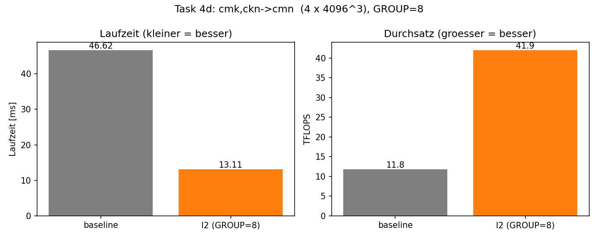

.. _ch05_loesung:

##################################################
Report: Contraction Interface and L2 Optimization
##################################################

.. contents:: Inhaltsverzeichnis
   :local:
   :depth: 2

Einleitung
==========

Dieses Kapitel dokumentiert unsere Lösung des fünften Assignments:
*Contraction Interface and L2 Optimization*. Aufbauend auf den
cuTile-Kernels aus Assignment 04 entwickeln wir ein
Konfigurations-Interface für Tensor-Kontraktionen, einen Optimizer,
der diese Configs transformiert, und nutzen das Ganze, um einen
L2-optimierten cuTile-Kernel für eine batched Matrix-Multiplikation
``cmk, ckn -> cmn`` abzuleiten.

Die Code-Basis ist nach Konzept statt nach Task-Nummer organisiert:

* ``src/config.py`` — Enums + ``Config``-Dataclass + ``generate_config`` (Task 1+2)
* ``src/optimizer.py`` — ``Optimizer``-Klasse (Task 3)
* ``src/kernel.py`` — cuTile-Kernels und Pipeline (Task 4a–c)
* ``src/benchmark.py`` — Verifikation + Benchmark (Task 4d)

Task 1: Config Class
=====================

Aufgabenstellung
-----------------

Ein deklaratives Datenmodell für Tensor-Kontraktionen: Enums für
Dimension-Typen, Execution-Strategien, Primitive- und Datentypen sowie
ein ``Config``-Dataclass, der eine konkrete Kontraktion vollständig
beschreibt.

Implementierung
----------------

Die Enums (``DimType``, ``ExecType``, ``PrimType``, ``LastType``,
``FirstType``, ``DataType``) werden mit ``enum.Enum`` und ``auto()``
definiert — die konkreten numerischen Werte sind irrelevant; was zählt
ist Identitäts-Vergleich (``x == DimType.K``) und ``.name`` für Reports.

Das ``Config``-Dataclass führt acht Felder ohne Default-Werte zusammen.
Jedes per-Dimension-Feld (``dim_types``, ``exec_types``, ``dim_sizes``)
ist eine Liste der Länge :math:`d`; ``strides`` ist eine
Liste-von-Listen, eine innere Liste pro Tensor (Inputs + Output).
**Stride 0 bedeutet: die Dimension kommt in diesem Tensor nicht vor.**
Diese Konvention macht alle per-Tensor-Listen exakt gleich lang und
vereinfacht die Optimizer-Operationen erheblich (kein Sonderfall „Dim
nicht im Tensor").

Task 2: Generating a Basic Config
==================================

Aufgabenstellung
-----------------

Eine Funktion ``generate_config(einsum, shapes)`` soll aus einem
einsum-String und den Eingabe-Shapes automatisch eine Basis-Config
erzeugen.

Implementierung
----------------

Die Klassifikations-Logik folgt der Vorlesung (Folie 8,
*Index Types in Einsum Expressions*):

.. list-table::
   :header-rows: 1
   :widths: 35 25 40

   * - Vorkommen
     - DimType
     - Begründung
   * - in allen Tensoren (inkl. Output)
     - ``C`` (Batch)
     - identisch in allen
   * - nur in Inputs (nicht im Output)
     - ``K``
     - kontrahiert / aufsummiert
   * - in Input 0 + Output, nicht in Input 1
     - ``M``
     - GEMM-Konvention :math:`A \cdot B = C`
   * - in Input 1 + Output, nicht in Input 0
     - ``N``
     - GEMM-Konvention

Die globale Dim-Reihenfolge ergibt sich aus dem **ersten Auftreten**
über Inputs und Output — konsistent mit numpys einsum-Semantik und
deterministisch.

Die Strides werden pro Tensor in **Row-Major-Reihenfolge** berechnet
(innerste Dim → 1, dann nach links akkumulieren) und auf die globale
Dim-Reihenfolge gemappt. Beispiel ``cmk,ckn->cmn`` mit Shapes
:math:`(4, 4096, 4096)` jeweils:

.. code-block:: text

   pos name    type  exec      size     stride_A    stride_B    stride_C
   ----------------------------------------------------------------------
   0   c       C     SEQ          4     16777216    16777216    16777216
   1   m       M     SEQ       4096         4096           0        4096
   2   k       K     SEQ       4096            1        4096           0
   3   n       N     SEQ       4096            0           1           1

Task 3: Optimizer Class
========================

Aufgabenstellung
-----------------

Ein ``Optimizer`` umhüllt eine Config und exponiert fünf
Transformations-Methoden, die Configs deklarativ in eine
cuTile-ausführbare Form überführen.

Task 3a: split_dim
-------------------

Zerlegt eine Dimension in zwei (``outer_size * inner_size == size``,
sonst ``ValueError``). Die Stride-Mathematik:

* Inner-Stride bleibt identisch zum alten Stride.
* Outer-Stride = ``old * inner_size`` (er steppt über ``inner_size``
  Elemente des inneren Strides).
* Stride 0 bleibt 0 für beide neue Dims.

``dim_type`` und ``exec_type`` werden auf beide neuen Dimensionen
vererbt.

Task 3b: fuse_dims
-------------------

Für jeden Tensor, in dem **beide** Dims auftauchen (Stride ≠ 0), müssen zwei
Bedingungen gelten:

1. **Adjazenz:** entweder ``stride[a] == stride[b] * size[b]`` (Reihenfolge
   ``a,b`` – a außen) oder ``stride[a] * size[a] == stride[b]`` (Reihenfolge
   ``b,a`` – b außen).
2. **Konsistente relative Reihenfolge:** Diese Reihenfolge (``a,b`` vs.
   ``b,a``) muss in *jedem* betroffenen Tensor **dieselbe** sein. Wären ``a``
   und ``b`` in Tensor X als ``a,b`` und in Tensor Y als ``b,a`` benachbart,
   sind beide je für sich adjazent, lassen sich aber **nicht** zu einer
   konsistenten Dimension verschmelzen – der Fusion fehlt eine wohldefinierte
   Semantik. Wir merken uns die Reihenfolge des ersten Tensors und werfen einen
   beschreibenden ``ValueError``, sobald ein späterer Tensor abweicht.

Tensoren, in denen mindestens eine Dim mit Stride 0 fehlt, werden übersprungen
(die Bedingung ist dort trivial erfüllt). Der neue Stride ist der innere
(kleinere) Stride ``min(stride[a], stride[b])`` bzw. der nicht-null Stride, wenn
nur einer ≠ 0 ist. ``b`` wird aus allen Listen entfernt; die ``a``-Position
erbt ``dim_type``/``exec_type``.

Sanity-Checks in ``optimizer.py``-``__main__``: ``split_dim`` gefolgt von
``fuse_dims`` liefert die ursprüngliche Config; und eine Config mit
inkonsistenter Reihenfolge (``a,b`` in einem, ``b,a`` im anderen Tensor) wird
korrekt abgelehnt.

Task 3c: permute_dims
----------------------

Umsortierung aller per-Dim-Listen analog ``torch.permute``:
``new[i] = old[permutation[i]]``. Validierung, dass ``permutation``
tatsächlich eine Permutation von ``range(n)`` ist, schützt vor
schwer zu debuggenden Folgefehlern.

Task 3d: make_executable
-------------------------

Heuristik in zwei Schritten:

1. Pro Typ M/N/K wird die **rechteste** passende Dim als ``PRIM``
   markiert. Verbleibende K-Dims werden ``SEQ`` (``PAR`` ist verboten),
   verbleibende M/N/C-Dims werden ``PAR`` (mehr Parallelismus).
2. Stabile Sortierung nach ``(exec_type_rang, original_index)`` mit
   Reihenfolge ``PAR < SEQ < PRIM``. Stabilität ist wichtig — innerhalb
   eines Blocks bleibt die Reihenfolge erhalten, sodass eine vorab
   gesetzte Reihenfolge (z. B. ``[m_l2, n_l2]`` statt ``[n_l2, m_l2]``)
   durchkommt.

Am Ende wird ``verify()`` aufgerufen — der Bauplan ist
bewiesenermaßen ausführbar oder die Methode wirft.

Task 3e: verify
----------------

Vier Bedingungen mit beschreibenden ``ValueError``-Meldungen:

1. Kein K mit ``exec_type=PAR``.
2. Alle ``SEQ`` links von allen ``PRIM``.
3. Alle ``PAR`` links von allen ``SEQ``.
4. ``PRIM`` ist ein zusammenhängender Block ganz rechts und enthält
   mindestens je ein M, N und K.

Bedingung 4 ist die strengste — sie codiert das cuTile-Constraint, dass
``ct.mma`` mindestens einen M-, N- und K-Operanden braucht.

Task 4: L2-Optimized Batched Contraction
=========================================

Aufgabenstellung
-----------------

Für die batched Matmul ``cmk, ckn -> cmn`` mit
:math:`|c| = 4`, :math:`|m| = |n| = |k| = 4096` soll ein
L2-optimierter cuTile-Kernel abgeleitet und gegen ein
naives Baseline-Mapping verglichen werden.

Task 4a: Basis-Config
----------------------

``build_basic_config()`` ist ein Einzeiler, der ``generate_config``
aufruft. Resultat:

.. code-block:: text

   pos name    type  exec      size     stride_A    stride_B    stride_C
   ----------------------------------------------------------------------
   0   c       C     SEQ          4     16777216    16777216    16777216
   1   m       M     SEQ       4096         4096           0        4096
   2   k       K     SEQ       4096            1        4096           0
   3   n       N     SEQ       4096            0           1           1

   data_type=FLOAT16  prim_main=GEMM  prim_last=NONE  prim_first=ZERO

Vier Dimensionen, alle ``SEQ`` — die rohe Beschreibung ohne jegliche
Hardware-Anpassung.

Task 4b: L2-Optimierung
------------------------

**Der Schlüssel:** Ein reiner ``(l2, prim)``-Split ist noch *keine*
Optimierung. Das PAR-Layout ``[c, m_l2, n_l2]`` als Grid enumeriert genau wie
die Baseline (zeilenweise über ``n_l2``) – die 2D-Lokalität fehlt. Diese
entsteht erst durch eine **zweite Split-Ebene**: ``m_l2`` und ``n_l2`` werden
nochmals in ``(super, group)`` zerlegt und die *Gruppen*-Achsen nach innen
permutiert. Weil die Grid-Enumeration die inneren Achsen zuerst durchläuft,
sweept sie ein ``group_m × group_n`` Super-Tile, bevor sie zum nächsten
Super-Block springt – **das ist der Swizzle, rein datengetrieben in der
Config**, ohne Index-Arithmetik im Kernel.

.. code-block:: python

   cfg = build_basic_config()
   opt = Optimizer(cfg)
   # 1) mma-Tile abspalten
   opt.split_dim(m_id, 64, 64)              # m -> (m_l2=64, m_prim=64)
   opt.split_dim(n_id, 64, 64)              # n -> (n_l2=64, n_prim=64)
   # 2) Super-Tile abspalten (GROUP_M = GROUP_N = 8)
   opt.split_dim(m_l2_id, 8, 8)             # m_l2 -> (m_super=8, m_group=8)
   opt.split_dim(n_l2_id, 8, 8)             # n_l2 -> (n_super=8, n_group=8)
   # 3) Gruppen-Achsen nach innen: PAR=[c, m_super, n_super, m_group, n_group]
   opt.permute_dims([0, 1, 5, 2, 6, 3, 7, 4])
   opt.make_executable()

Resultat (GROUP = 8):

.. code-block:: text

   pos name     type  exec      size     stride_A    stride_B    stride_C
   -----------------------------------------------------------------------
   0   c        C     PAR          4     16777216    16777216    16777216
   1   m_super  M     PAR          8      2097152           0     2097152
   2   n_super  N     PAR          8            0         512         512
   3   m_group  M     PAR          8       262144           0      262144
   4   n_group  N     PAR          8            0          64          64
   5   m_prim   M     PRIM        64         4096           0        4096
   6   n_prim   N     PRIM        64            0           1           1
   7   k        K     PRIM      4096            1        4096           0

**Wahl der Tile-Größen.** ``m_prim = n_prim = 64``, ``k_prim = 32`` – direkt
aus dem Peak von Assignment 04 Task 3 übernommen (belegt-beste
``ct.mma``-Tile-Größen auf GB10, FP16).

**Wahl der Gruppengröße.** ``GROUP_M = GROUP_N = 8`` (empirisch, siehe
Benchmark). Working-Set pro 2D-Super-Tile (FP16, K=4096): ``GROUP_M`` A-Streifen
plus ``GROUP_N`` B-Streifen à je ``64 · 4096 · 2 B``:

.. math::

   W(\text{GROUP}) \approx 2 \cdot \text{GROUP} \cdot 64 \cdot 4096 \cdot 2 \;\text{B}
                        = \text{GROUP} \cdot 1\,\text{MB}

Bei ``GROUP = 8`` sind das ≈ 8 MB – passt in den 24 MB L2 der GB10 und lässt
Platz für mehrere gleichzeitig aktive Super-Tiles.

Kernel-Design
-------------

**Baseline.** 3D-Grid ``(Cd, num_m_tiles, num_n_tiles)`` mit mma-Tile
``(64, 64, 32)``; jeder Block berechnet ein Output-Tile mit einer K-Schleife.
BIDs in der cuTile-Default-Reihenfolge (n innermost). Wave-Mitglieder teilen
dieselbe ``m_tile``-Zeile (gut für A-Reuse), die B-Spalten sind aber alle
verschieden – B wird kaum aus dem L2 wiederverwendet.

**L2-optimiert (config-getrieben).** Der Kernel ist **generisch**: ein flaches
1D-Grid über die PAR-Achsen der Config, GEMM über die PRIM-Achsen. Er enthält
**keine** Swizzle-Formel mehr, sondern dekodiert den BID per verschachteltem
divmod über die PAR-Größen (aus der Config gelesen) und rekonstruiert die
Tile-Indizes aus Super- und Group-Anteil:

.. code-block:: python

   # Decode in Config-Reihenfolge [c, m_super, n_super, m_group, n_group],
   # innerste Achse (n_group) zuerst:
   n_grp = bid %  NG;  t = bid // NG
   m_grp = t %  MG;    t = t // MG
   n_sup = t %  NS;    t = t // NS
   m_sup = t %  MS;    pid_c = t // MS
   pid_m = m_sup * MG + m_grp     # m_l2-Tile-Index
   pid_n = n_sup * NG + n_grp     # n_l2-Tile-Index

Die Größen ``MS, NS, MG, NG`` liefert ``_extract_l2_params(cfg)`` – ändert man
die Split-/Permute-Pipeline in ``build_l2_config``, ändert sich das
Launch-Layout automatisch, ohne den Kernel anzufassen. Wirkung: Weil
``m_group``/``n_group`` die innersten PAR-Achsen sind, fallen aufeinander
folgende BIDs in ein ``GROUP_M × GROUP_N`` Super-Tile → **A- und B-Tiles**
werden über den L2 geteilt, nicht nur die A-Seite wie im Baseline.

Verifikation
-------------

Beide Kernels werden mit ``C=2, M=N=K=128`` gegen ``torch.einsum``
mit FP32-Promotion und FP16-Output verglichen
(``atol=2e-1, rtol=2e-2``):

.. code-block:: text

   baseline   allclose=True   max_abs_err=0.0078
   l2         allclose=True   max_abs_err=0.0078

Beide Kernels liegen exakt auf einer FP16-ULP (:math:`2^{-7} \approx 0.0078`)
— FP16-Quantisierungsrauschen, identisch zwischen Baseline und
L2-Variante. Numerisch äquivalent.

Benchmark
---------

Gemessen mit ``triton.testing.do_bench`` auf der DGX Spark (GB10),
FP16-Inputs, FP32-Akkumulator. FLOPs der Kontraktion:
:math:`2 \cdot |c| \cdot |m| \cdot |n| \cdot |k| = 2 \cdot 4 \cdot 4096^3 \approx 5{,}5 \cdot 10^{11}`.

GROUP-Sweep (Quadrat-Super-Tile ``GROUP_M = GROUP_N``):

.. list-table::
   :header-rows: 1
   :widths: 25 18 18 18 21

   * - Variante
     - GROUP
     - Laufzeit (ms)
     - TFLOPS
     - vs. Baseline
   * - Baseline
     - —
     - 46,62
     - 11,8
     - 1,00×
   * - L2 (config)
     - 4
     - 14,91
     - 36,9
     - 3,13×
   * - L2 (config)
     - 8
     - **13,11**
     - **41,9**
     - **3,56×**
   * - L2 (config)
     - 32
     - 14,02
     - 39,2
     - 3,33×

Die Absolutwerte schwanken zwischen ``do_bench``-Läufen um einige Prozent;
die *relative* Ordnung – Baseline ≈ 4× langsamer, ``GROUP = 8`` als Optimum –
ist über alle Läufe stabil.

   ``GROUP_M = GROUP_N = 4``: bereits 3,13× Speedup, aber kleinere
   Super-Tiles teilen weniger A/B-Streifen als GROUP=8.

   ``GROUP_M = GROUP_N = 8``: beste Konfiguration mit 3,56× Speedup
   (41,9 TFLOPS), ≈ 8 MB Working-Set im L2.

   ``GROUP_M = GROUP_N = 32``: bleibt mit 3,33× stark — das echte
   2D-Super-Tile hält den gleichzeitig aktiven Working-Set kompakt.

Beobachtungen und Vermutungen
------------------------------

* **GROUP=8 ist der Sweet Spot.** 3,56× Speedup, 41,9 TFLOPS — die
  Hardware-Auslastung springt auf das Niveau einer optimierten GEMM. Ein
  2D-Super-Tile aus 8×8 mma-Tiles hält ≈ 8 MB Working-Set im L2.

* **GROUP=4 etwas schwächer (3,13×).** Kleinere Super-Tiles teilen weniger
  A/B-Streifen pro Gruppe → geringere L2-Wiederverwendung.

* **GROUP=32 bleibt stark (3,33×), kollabiert NICHT.** Das ist der Unterschied
  zum naiven 1D-„Banding" (eine ganze M-Zeile × *alle* N-Spalten, deren
  B-Working-Set den L2 sprengt): Hier bildet die Config ein *echtes 2D*-
  Super-Tile, sodass der gleichzeitig aktive Working-Set kompakt bleibt (die
  48 SMs decken immer nur einen Ausschnitt ab). Die L2-Lokalität überlebt
  damit auch große Gruppen.

* **L2-Optimierung ist eine reine Reihenfolge-Frage.** Baseline und L2-Variante
  führen exakt dieselbe Anzahl ``ct.mma``- und ``ct.load``-Operationen aus —
  der Unterschied kommt ausschließlich aus der *Reihenfolge*, in der die BIDs
  auf die SMs fallen. Kompakteste Demonstration des Vorlesungs-Mottos
  *„memory access patterns dominate over compute"*.

* **Swizzle datengetrieben in der Config.** Die Super-Tile-Struktur entsteht
  vollständig aus den ``split_dim``/``permute_dims``-Operationen (zwei
  Split-Ebenen, Gruppen-Achsen innen); der Kernel ist generisch und liest die
  PAR-/PRIM-Größen per ``_extract_l2_params`` aus der Config. Ändert man die
  Gruppengröße oder die Achsen-Reihenfolge in der Config, ändert sich das
  Verhalten **ohne** Kernel-Änderung — genau der Sinn des
  ``Config``/``Optimizer``-Interfaces.

Beiträge
=========

.. list-table::
   :header-rows: 1
   :widths: 30 70

   * - Person
     - Beitrag
   * - Moritz Martin
     - Implementierung Task 1 (Enums + Config-Dataclass), Task 2
       (``generate_config`` mit Klassifikations- und Stride-Logik) und
       Task 3 (Optimizer mit ``split_dim``, ``fuse_dims``,
       ``permute_dims``, ``make_executable``, ``verify``);
       Sphinx-Report.
   * - Oliver Dietzel
     - Implementierung Task 4 (Basis- und L2-Config-Pipeline,
       ``kernel_baseline`` und der generische, config-getriebene
       ``kernel_l2_optimized`` mit 2D-Super-Tile aus der Config,
       Verifikation gegen ``torch.einsum``, Benchmark + GROUP-Sweep
       auf DGX Spark, Plot).
